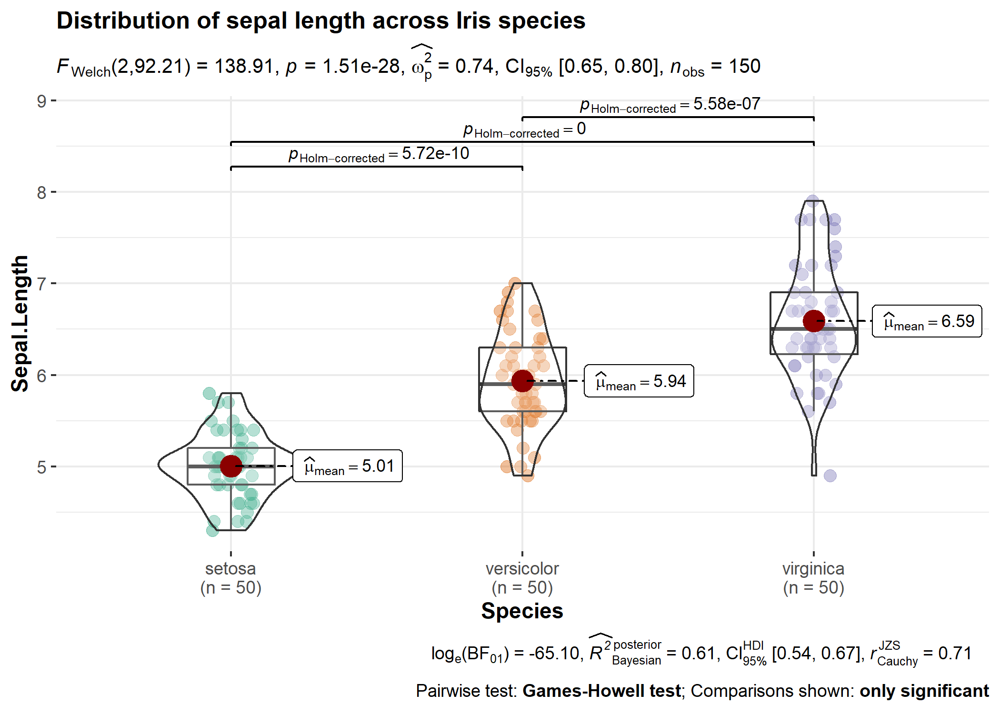

  <!-- README.md is generated from README.Rmd. Please edit that file -->

```{r}
#| echo = FALSE
options(pillar.width = Inf, pillar.bold = TRUE, pillar.subtle_num = TRUE)

knitr::opts_chunk$set(
  collapse  = TRUE,
  dpi       = 300,
  out.width = "100%",
  comment   = "#>",
  warning   = FALSE,
  message   = FALSE,
  fig.path  = "man/figures/README-"
)

set.seed(123)
library(statsExpressions)
```

# `{statsExpressions}`: Tidy dataframes and expressions with statistical details

Status | Usage | Miscellaneous
----------------- | ----------------- | ----------------- 
[](https://github.com/IndrajeetPatil/statsExpressions/actions) | [](https://CRAN.R-project.org/package=statsExpressions) | [](https://app.codecov.io/gh/IndrajeetPatil/statsExpressions?branch=main)
[](https://lifecycle.r-lib.org/articles/stages.html) | [](https://CRAN.R-project.org/package=statsExpressions) | [](https://doi.org/10.21105/joss.03236) 
 
# Introduction 

```{r, child = "inst/rmd-fragments/statsExpressions-package.Rmd"}
```

# Installation

| Type        | Command                                       |
| :---------- | :-------------------------------------------- |
| Release     | `install.packages("statsExpressions")`        |
| Development | `pak::pak("IndrajeetPatil/statsExpressions")` |

On Linux, `{statsExpressions}` installation may require additional system dependencies, which can be checked using:

```{r, eval=FALSE}
pak::pkg_sysreqs("statsExpressions")
```

# Citation

The package can be cited as:

```{r}
#| label = "citation",
#| comment = ""
citation("statsExpressions")
```

# General Workflow

```{r}
#| echo = FALSE,
#| out.width = "80%"
knitr::include_graphics("man/figures/card.png")
```

# Summary of functionality

```{r, child = "inst/rmd-fragments/functionality.Rmd"}
```

# Tidy dataframes from statistical analysis

To illustrate the simplicity of this syntax, let's say we want to run a one-way
ANOVA. If we first run a non-parametric ANOVA and then decide to run a robust
ANOVA instead, the syntax remains the same and the statistical approach can be
modified by changing a single argument:

```{r}
#| label = "df"

mtcars %>% oneway_anova(cyl, wt, type = "nonparametric")

mtcars %>% oneway_anova(cyl, wt, type = "robust")
```

All possible output dataframes from functions are tabulated here:
<https://indrajeetpatil.github.io/statsExpressions/articles/web_only/dataframe_outputs.html>

Needless to say this will also work with the `kable` function to generate a
table:

```{r}
#| label = "kable"

set.seed(123)

# one-sample robust t-test
# we will leave `expression` column out; it's not needed for using only the dataframe
mtcars %>%
  one_sample_test(wt, test.value = 3, type = "robust") %>%
  dplyr::select(-expression) %>%
  knitr::kable()
```

These functions are also compatible with other popular data manipulation
packages. 

For example, let's say we want to run a one-sample *t*-test for all levels of a
certain grouping variable. We can use `dplyr` to do so:

```{r}
#| label = "grouped_df"
# for reproducibility
set.seed(123)
library(dplyr)

# grouped operation
# running one-sample test for all levels of grouping variable `cyl`
mtcars %>%
  group_by(cyl) %>%
  group_modify(~ one_sample_test(.x, wt, test.value = 3), .keep = TRUE) %>%
  ungroup()
```

# Using expressions in custom plots

Note that *expression* here means **a pre-formatted in-text statistical result**.
In addition to other details contained in the dataframe, there is also a column
titled `expression`, which contains expression with statistical details and can
be displayed in a plot.

For **all** statistical test expressions, the default template attempt to follow
the gold standard for statistical reporting.

For example, here are results from Welch's *t*-test:


Let's load the needed library for visualization:

```{r}
library(ggplot2)
```

## Expressions for centrality measure

**Note that when used in a geometric layer, the expression need to be parsed.**

```{r}
#| label = "centrality"

# displaying mean for each level of `cyl`
centrality_description(mtcars, cyl, wt) |>
  ggplot(aes(cyl, wt)) +
  geom_point() +
  geom_label(aes(label = expression), parse = TRUE)
```

Here are a few examples for supported analyses.

## Expressions for one-way ANOVAs

The returned data frame will always have a column called `expression`. 

Assuming there is only a single result you need to display in a plot, to use it in a plot, you have two options:

- extract the expression from the list column (`results_data$expression[[1]]`) without parsing
- use the list column as is, in which case you will need to parse it (`parse(text = results_data$expression)`)

If you want to display more than one expression in a plot, you will *have to* parse them.

### Between-subjects design

```{r}
#| label = "anova_rob1"

set.seed(123)
library(ggridges)

results_data <- oneway_anova(iris, Species, Sepal.Length, type = "robust")

# create a ridgeplot
ggplot(iris, aes(x = Sepal.Length, y = Species)) +
  geom_density_ridges() +
  labs(
    title = "A heteroscedastic one-way ANOVA for trimmed means",
    subtitle = results_data$expression[[1]]
  )
```

### Within-subjects design

```{r}
#| label = "anova_parametric2"

set.seed(123)
library(WRS2)
library(ggbeeswarm)

results_data <- oneway_anova(
  WineTasting,
  Wine,
  Taste,
  paired = TRUE,
  subject.id = Taster,
  type = "np"
)

ggplot2::ggplot(WineTasting, aes(Wine, Taste, color = Wine)) +
  geom_quasirandom() +
  labs(
    title = "Friedman's rank sum test",
    subtitle = parse(text = results_data$expression)
  )
```

## Expressions for two-sample tests

### Between-subjects design

```{r}
#| label = "t_two"

set.seed(123)
library(gghalves)

results_data <- two_sample_test(ToothGrowth, supp, len)

ggplot(ToothGrowth, aes(supp, len)) +
  geom_half_dotplot() +
  labs(
    title = "Two-Sample Welch's t-test",
    subtitle = parse(text = results_data$expression)
  )
```

### Within-subjects design

```{r}
#| label = "t_two_paired1"

set.seed(123)
library(tidyr)
library(PairedData)
data(PrisonStress)

# get data in tidy format
df <- pivot_longer(PrisonStress, starts_with("PSS"), names_to = "PSS", values_to = "stress")

results_data <- two_sample_test(
  data = df,
  x = PSS,
  y = stress,
  paired = TRUE,
  subject.id = Subject,
  type = "np"
)

# plot
paired.plotProfiles(PrisonStress, "PSSbefore", "PSSafter", subjects = "Subject") +
  labs(
    title = "Two-sample Wilcoxon paired test",
    subtitle = parse(text = results_data$expression)
  )
```

## Expressions for one-sample tests

```{r}
#| label = "t_one"

set.seed(123)

# dataframe with results
results_data <- one_sample_test(mtcars, wt, test.value = 3, type = "bayes")

# creating a histogram plot
ggplot(mtcars, aes(wt)) +
  geom_histogram(alpha = 0.5) +
  geom_vline(xintercept = mean(mtcars$wt), color = "red") +
  labs(subtitle = parse(text = results_data$expression))
```

## Expressions for correlation analysis

Let's look at another example where we want to run correlation analysis:

```{r}
#| label = "corr"

set.seed(123)

# dataframe with results
results_data <- corr_test(mtcars, mpg, wt, type = "nonparametric")

# create a scatter plot
ggplot(mtcars, aes(mpg, wt)) +
  geom_point() +
  geom_smooth(method = "lm", formula = y ~ x) +
  labs(
    title = "Spearman's rank correlation coefficient",
    subtitle = parse(text = results_data$expression)
  )
```

## Expressions for contingency table analysis

For categorical/nominal data - one-sample:

```{r}
#| label = "gof"

set.seed(123)

# dataframe with results
results_data <- contingency_table(
  as.data.frame(table(mpg$class)),
  Var1,
  counts = Freq,
  type = "bayes"
)

# create a pie chart
ggplot(as.data.frame(table(mpg$class)), aes(x = "", y = Freq, fill = factor(Var1))) +
  geom_bar(width = 1, stat = "identity") +
  theme(axis.line = element_blank()) +
  # cleaning up the chart and adding results from one-sample proportion test
  coord_polar(theta = "y", start = 0) +
  labs(
    fill = "Class",
    x = NULL,
    y = NULL,
    title = "Pie Chart of class (type of car)",
    caption = parse(text = results_data$expression)
  )
```

You can also use these function to get the expression in return without having
to display them in plots:

```{r}
#| label = "expr_output"

set.seed(123)

# Pearson's chi-squared test of independence
contingency_table(mtcars, am, vs)$expression[[1]]
```

## Expressions for meta-analysis

```{r}
#| label = "metaanalysis",
#| fig.height = 14,
#| fig.width = 12

set.seed(123)
library(metaviz)
library(metaplus)

# dataframe with results
results_data <- meta_analysis(dplyr::rename(mozart, estimate = d, std.error = se))

# meta-analysis forest plot with results random-effects meta-analysis
viz_forest(
  x = mozart[, c("d", "se")],
  study_labels = mozart[, "study_name"],
  xlab = "Cohen's d",
  variant = "thick",
  type = "cumulative"
) +
  labs(
    title = "Meta-analysis of Pietschnig, Voracek, and Formann (2010) on the Mozart effect",
    subtitle = parse(text = results_data$expression)
  ) +
  theme(text = element_text(size = 12))
```

# Customizing details to your liking

Sometimes you may not wish include so many details in the subtitle. In that
case, you can extract the expression and copy-paste only the part you wish to
include. For example, here only statistic and *p*-values are included:

```{r}
#| label = "custom_expr"

set.seed(123)

# extracting detailed expression
(res_expr <- oneway_anova(iris, Species, Sepal.Length, var.equal = TRUE)$expression[[1]])

# adapting the details to your liking
ggplot(iris, aes(x = Species, y = Sepal.Length)) +
  geom_boxplot() +
  labs(subtitle = ggplot2::expr(paste(
    NULL, italic("F"), "(", "2", ",", "147", ") = ", "119.26", ", ",
    italic("p"), " = ", "1.67e-31"
  )))
```

# Summary of tests and effect sizes

Here a go-to summary about statistical test carried out and the returned effect
size for each function is provided. This should be useful if one needs to find
out more information about how an argument is resolved in the underlying package
or if one wishes to browse the source code. So, for example, if you want to know
more about how one-way (between-subjects) ANOVA, you can run
`?stats::oneway.test` in your R console.

## `centrality_description`

```{r, child = "inst/rmd-fragments/centrality_description.Rmd"}
```

## `oneway_anova`

```{r, child = "inst/rmd-fragments/oneway_anova.Rmd"}
```

## `two_sample_test` 

```{r, child = "inst/rmd-fragments/two_sample_test.Rmd"}
```

## `one_sample_test`

```{r, child = "inst/rmd-fragments/one_sample_test.Rmd"}
```

## `corr_test`

```{r, child = "inst/rmd-fragments/corr_test.Rmd"}
```

## `contingency_table`

```{r, child = "inst/rmd-fragments/contingency_table.Rmd"}
```

## `meta_analysis`

```{r, child = "inst/rmd-fragments/meta_analysis.Rmd"}
```

# Usage in `{ggstatsplot}`

Note that these functions were initially written to display results from
statistical tests on ready-made `{ggplot2}` plots implemented in `{ggstatsplot}`.

For detailed documentation, see the package website:
<https://indrajeetpatil.github.io/ggstatsplot/>

Here is an example from `{ggstatsplot}` of what the plots look like when the
expressions are displayed in the subtitle-



# Acknowledgments

The hexsticker and the schematic illustration of general workflow were
generously designed by Sarah Otterstetter (Max Planck Institute for Human
Development, Berlin).

# Contributing

Bug reports, suggestions, questions, and (most of all)
contributions are welcome.

Please note that this project is released with a 
[Contributor Code of Conduct](https://github.com/IndrajeetPatil/statsExpressions/blob/main/.github/CODE_OF_CONDUCT.md). By participating in this project you agree to abide by its terms.
