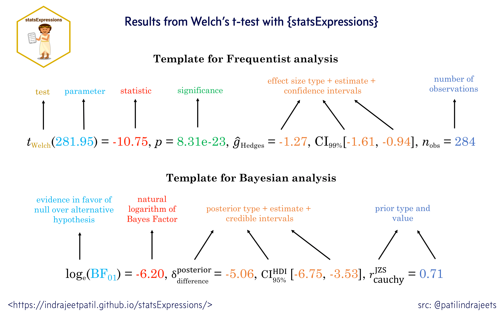

  <!-- README.md is generated from README.Rmd. Please edit that file -->

```{r, echo = FALSE}
# show me all columns
options(tibble.width = Inf)

knitr::opts_chunk$set(
  collapse = TRUE,
  dpi = 300,
  out.width = "100%",
  comment = "#>",
  warning = FALSE,
  message = FALSE,
  fig.path = "man/figures/README-"
)
```

# `statsExpressions`: Expressions with statistical details

Package | Status | Usage | GitHub | References
----------------- | ----------------- | ----------------- | ----------------- | -----------------
[](https://CRAN.R-project.org/package=statsExpressions) | [](https://travis-ci.org/IndrajeetPatil/statsExpressions) | [](https://CRAN.R-project.org/package=statsExpressions) | [](https://github.com/IndrajeetPatil/statsExpressions/) | [](https://indrajeetpatil.github.io/statsExpressions/)
[](https://cran.r-project.org/web/checks/check_results_statsExpressions.html) | [](https://ci.appveyor.com/project/IndrajeetPatil/statsExpressions) | [](https://CRAN.R-project.org/package=statsExpressions) | [$forks[[1]]`-blue.svg)](https://github.com/IndrajeetPatil/statsExpressions/) | [](https://indrajeetpatil.github.io/statsExpressions/reference/index.html)
[](https://cran.r-project.org/) | [](https://www.tidyverse.org/lifecycle/) | [](https://CRAN.R-project.org/package=statsExpressions) | [$open_issues[[1]]`-red.svg)](https://github.com/IndrajeetPatil/statsExpressions/issues) | [](https://CRAN.R-project.org/package=statsExpressions/vignettes/)
[](https://github.com/IndrajeetPatil/statsExpressions) | [](https://coveralls.io/github/IndrajeetPatil/statsExpressions?branch=master) | [](https://CRAN.R-project.org/package=statsExpressions) | [](https://github.com/IndrajeetPatil/statsExpressions) | [](https://doi.org/10.5281/zenodo.3386122)
[](https://www.gnu.org/licenses/gpl-3.0.en.html) | [](https://codecov.io/gh/IndrajeetPatil/statsExpressions?branch=master) | [](https://github.com/IndrajeetPatil/statsExpressions/blob/master/tests/README.md) | [)`-yellowgreen.svg)](https://github.com/IndrajeetPatil/statsExpressions/commits/master) | [](https://github.com/IndrajeetPatil/statsExpressions/commits/master)
[](https://CRAN.R-project.org/package=statsExpressions) |  [](https://github.com/IndrajeetPatil/statsExpressions) | [](https://gitter.im/statsExpressions/community) | [](http://www.repostatus.org/#active) | [](https://github.com/IndrajeetPatil/statsExpressions/issues)

# Introduction

[`statsExpressions`](https://indrajeetpatil.github.io/statsExpressions/)
provides statistical processing backend for the
[`ggstatsplot`](https://indrajeetpatil.github.io/ggstatsplot/) package, which
combines `ggplot2` visualizations with expressions containing results
from statistical tests. `statsExpressions` contains all functions needed to
create these expressions.

# Installation

To get the latest, stable `CRAN` release:

```{r installationCRAN, eval = FALSE}
install.packages("statsExpressions")
```

You can get the **development** version of the package from `GitHub`. To see
what new changes (and bug fixes) have been made to the package since the last
release on `CRAN`, you can check the detailed log of changes here:
<https://indrajeetpatil.github.io/statsExpressions/news/index.html>

If you are in hurry and want to reduce the time of installation,
prefer-

```{r installation1, eval = FALSE}
# needed package to download from GitHub repo
install.packages("remotes")

# downloading the package from GitHub
remotes::install_github(
  repo = "IndrajeetPatil/statsExpressions", # package path on GitHub
  dependencies = FALSE, # assumes you have already installed needed packages
  quick = TRUE # skips docs, demos, and vignettes
)
```

If time is not a constraint-

```{r installation2, eval = FALSE}
remotes::install_github(
  repo = "IndrajeetPatil/statsExpressions", # package path on GitHub
  dependencies = TRUE, # installs packages which statsExpressions depends on
  upgrade_dependencies = TRUE # updates any out of date dependencies
)
```

# Citation

If you want to cite this package in a scientific journal or in any other
context, run the following code in your `R` console:

```{r citation, eval = FALSE}
citation("statsExpressions")
```

# Documentation and Examples

To see the documentation relevant for the **development** version of the package,
see the dedicated website for `statsExpressions`, which is updated after every new
commit: <https://indrajeetpatil.github.io/statsExpressions/>.

# Summary of types of statistical analyses

Currently, it supports only the most common types of statistical tests.
Specifically, **parametric**, **non-parametric**, **robust**, and **bayesian**
versions of:

  - **t-test**
  - **anova**
  - **correlation** tests
  - **contingency table** analysis
  - **meta-analysis**

The table below summarizes all the different types of analyses currently
supported in this package-

Description | Parametric | Non-parametric | Robust | Bayes Factor
------------------ | ---- | ----- | ----| ----- 
Between group/condition comparisons | <font color="green">Yes</font> | <font color="green">Yes</font> | <font color="green">Yes</font> | <font color="green">Yes</font>
Within group/condition comparisons | <font color="green">Yes</font> | <font color="green">Yes</font> | <font color="green">Yes</font> | <font color="green">Yes</font>
Distribution of a numeric variable | <font color="green">Yes</font> | <font color="green">Yes</font> | <font color="green">Yes</font> | <font color="green">Yes</font>
Correlation between two variables | <font color="green">Yes</font> | <font color="green">Yes</font> | <font color="green">Yes</font> | <font color="green">Yes</font>
Association between categorical variables | <font color="green">Yes</font> | `NA` | `NA` | <font color="green">Yes</font>
Equal proportions for categorical variable levels | <font color="green">Yes</font> | `NA` | `NA` | <font color="green">Yes</font>
Random-effects meta-analysis | <font color="green">Yes</font> | <font color="red">No</font> | <font color="green">Yes</font> | <font color="green">Yes</font>

# Statistical reporting

For **all** statistical test expressions, the default template abides by the
[APA](https://my.ilstu.edu/~jhkahn/apastats.html) gold standard for statistical
reporting. For example, here are results from Yuen's test for trimmed means
(robust *t*-test):



# Summary of statistical tests and effect sizes

Here is a summary table of all the statistical tests currently supported across
various functions:
<https://indrajeetpatil.github.io/statsExpressions/articles/stats_details.html>

# Primary functions

A list of primary functions in this package can be found at the package website:
<https://indrajeetpatil.github.io/statsExpressions/reference/index.html>

Following are few examples of how these functions can be used.

## Example: Expressions for one-way ANOVAs

### Between-subjects design

Let's say we want to check differences in weight of the vehicle based on number of
cylinders in the engine and wish to carry out Welch's ANOVA:

```{r anova_parametric1}
# setup
set.seed(123)
library(ggplot2)
library(statsExpressions)

# create a boxplot
ggplot(iris, aes(x = Species, y = Sepal.Length)) +
  geom_boxplot() +
  labs(
    title = "Fisher's one-way ANOVA",
    subtitle = expr_anova_parametric(iris, Species, Sepal.Length, var.equal = TRUE)
  )
```

In case you change your mind and now want to carry out a robust ANOVA instead.
Also, let's use a different kind of a visualization:

```{r anova_rob1}
# setup
set.seed(123)
library(ggplot2)
library(statsExpressions)
library(ggridges)

# create a ridgeplot
ggplot(iris, aes(x = Sepal.Length, y = Species)) +
  geom_density_ridges(
    jittered_points = TRUE, quantile_lines = TRUE,
    scale = 0.9, vline_size = 1, vline_color = "red",  
    position = position_raincloud(adjust_vlines = TRUE)
  ) +
  labs(
    title = "A heteroscedastic one-way ANOVA for trimmed means",
    subtitle = expr_anova_robust(iris, Species, Sepal.Length, messages = FALSE)
  )
```

Needless to say, you can also use these functions to display results in
`ggplot`-extension packages. For example, `ggpubr`:

```{r ggpubr_anova}
set.seed(123)
library(ggpubr)
library(ggplot2)

# plot
ggboxplot(
  ToothGrowth,
  x = "dose",
  y = "len",
  color = "dose",
  palette = c("#00AFBB", "#E7B800", "#FC4E07"),
  add = "jitter",
  shape = "dose"
) + # adding results from stats analysis using `statsExpressions`
  labs(
    title = "Kruskall-Wallis test",
    subtitle = expr_anova_nonparametric(ToothGrowth, dose, len, type = "np")
  )
```

### Within-subjects design

Let's now see an example of a repeated measures one-way ANOVA.

```{r anova_parametric2}
# setup
set.seed(123)
library(ggplot2)
library(WRS2)
library(ggbeeswarm)
library(statsExpressions)

ggplot2::ggplot(WineTasting, aes(Wine, Taste, color = Wine)) +
  geom_quasirandom() +
  labs(
    title = "Friedman's rank sum test",
    subtitle = expr_anova_nonparametric(WineTasting, Wine, Taste, paired = TRUE, type = "np")
  )
```

## Example: Expressions for two-sample tests

### Between-subjects design

```{r t_two}
# setup
set.seed(123)
library(ggplot2)
library(hrbrthemes)
library(statsExpressions)

# create a plot
ggplot(ToothGrowth, aes(supp, len)) +
  geom_boxplot() +
  theme_ipsum_rc() +
  # adding a subtitle with
  labs(
    title = "Two-Sample Welch's t-test",
    subtitle = expr_t_parametric(ToothGrowth, supp, len)
  )
```

Example with `ggpubr`:

```{r t_two_ggpubr}
# setup
set.seed(123)
library(ggplot2)
library(ggpubr)
library(statsExpressions)

# basic plot
gghistogram(
  data.frame(
    sex = factor(rep(c("F", "M"), each = 200)),
    weight = c(rnorm(200, 55), rnorm(200, 58))
  ),
  x = "weight",
  add = "mean",
  rug = TRUE,
  fill = "sex",
  palette = c("#00AFBB", "#E7B800"),
  add_density = TRUE
) + # displaying stats results
  labs(
    title = "Yuen's two-sample test for trimmed means",
    subtitle = expr_t_robust(
      data = data.frame(
        sex = factor(rep(c("F", "M"), each = 200)),
        weight = c(rnorm(200, 55), rnorm(200, 58))
      ),
      x = sex,
      y = weight,
      type = "robust",
      messages = FALSE
    )
  )
```

Another example with `ggiraphExtra`:

```{r t_ggiraphExtra}
# setup
set.seed(123)
library(ggplot2)
library(ggiraphExtra)
library(gcookbook)
library(statsExpressions)

# plot
ggDot(heightweight, aes(sex, heightIn, fill = sex),
  boxfill = "white",
  binwidth = 0.4
) +
  labs(
    title = "Wilcoxon two-sample test",
    subtitle = expr_t_nonparametric(heightweight, sex, heightIn, type = "np")
  )
```

### Within-subjects design

We can also have a look at a repeated measures design and the related expressions.

```{r t_two_paired1}
# setup
set.seed(123)
library(ggplot2)
library(statsExpressions)
library(tidyr)
library(PairedData)
data(PrisonStress)

# plot
paired.plotProfiles(PrisonStress, "PSSbefore", "PSSafter", subjects = "Subject") +
  # `statsExpressions` needs data in the tidy format
  labs(
    title = "Two-sample Wilcoxon paired test",
    subtitle = expr_t_nonparametric(
      data = pivot_longer(PrisonStress, starts_with("PSS"), "PSS", values_to = "stress"),
      x = PSS,
      y = stress,
      paired = TRUE,
      type = "nonparametric"
    )
  )
```

## Example: Expressions for one-sample tests

```{r t_one}
# setup
set.seed(123)
library(ggplot2)
library(statsExpressions)

# creating a histogram plot
ggplot(mtcars, aes(wt)) +
  geom_histogram(alpha = 0.5) +
  geom_vline(xintercept = mean(mtcars$wt), color = "red") +
  # adding a caption with a non-parametric one-sample test
  labs(
    title = "One-Sample Wilcoxon Signed Rank Test",
    subtitle = expr_t_onesample(mtcars, wt, test.value = 3, type = "nonparametric")
  )
```

## Example: Expressions for correlation analyses

Let's look at another example where we want to run correlation analysis:

```{r corr}
# setup
set.seed(123)
library(ggplot2)
library(statsExpressions)

# create a ridgeplot
ggplot(mtcars, aes(mpg, wt)) +
  geom_point() +
  geom_smooth(method = "lm") +
  labs(
    title = "Spearman's rank correlation coefficient",
    subtitle = expr_corr_test(mtcars, mpg, wt, type = "nonparametric")
  )
```

## Example: Expressions for contingency table analysis

For categorical/nominal data

```{r gof}
# setup
set.seed(123)
library(ggplot2)
library(statsExpressions)

# basic pie chart
ggplot(as.data.frame(table(mpg$class)), aes(x = "", y = Freq, fill = factor(Var1))) +
  geom_bar(width = 1, stat = "identity") +
  theme(axis.line = element_blank()) +
  # cleaning up the chart and adding results from one-sample proportion test
  coord_polar(theta = "y", start = 0) +
  labs(
    fill = "Class",
    x = NULL,
    y = NULL,
    title = "Pie Chart of class (type of car)",
    subtitle = expr_onesample_proptest(as.data.frame(table(mpg$class)), Var1, counts = Freq),
    caption = "One-sample goodness of fit proportion test"
  )
```

You can also use these function to get the expression in return without having
to display them in plots:

```{r expr_output}
# setup
set.seed(123)
library(ggplot2)
library(statsExpressions)

# Pearson's chi-squared test of independence
expr_contingency_tab(mtcars, am, cyl, messages = FALSE)
```

## Example: Expressions for meta-analysis

```{r metaanalysis, fig.height=14, fig.width=12}
# setup
set.seed(123)
library(metaviz)
library(ggplot2)

# meta-analysis forest plot with results random-effects meta-analysis
viz_forest(
  x = mozart[, c("d", "se")],
  study_labels = mozart[, "study_name"],
  xlab = "Cohen's d",
  variant = "thick",
  type = "cumulative"
) + # use `statsExpressions` to create expression containing results
  labs(
    title = "Meta-analysis of Pietschnig, Voracek, and Formann (2010) on the Mozart effect",
    subtitle = expr_meta_parametric(dplyr::rename(mozart, estimate = d, std.error = se))
  ) +
  theme(text = element_text(size = 12))
```

# Usage in `ggstatsplot`

Note that these functions were initially written to display results from
statistical tests on ready-made `ggplot2` plots implemented in `ggstatsplot`.

For detailed documentation, see the package website:
<https://indrajeetpatil.github.io/ggstatsplot/>

Here is an example from `ggstatsplot` of what the plots look like when the
expressions are displayed in the subtitle-


# Code coverage

As the code stands right now, here is the code coverage for all primary
functions involved:
<https://codecov.io/gh/IndrajeetPatil/statsExpressions/tree/master/R>

# Contributing

I'm happy to receive bug reports, suggestions, questions, and (most of all)
contributions to fix problems and add features. I personally prefer using the
`GitHub` issues system over trying to reach out to me in other ways (personal
e-mail, Twitter, etc.). Pull Requests for contributions are encouraged.

Here are some simple ways in which you can contribute (in the increasing order
of commitment):

  - Read and correct any inconsistencies in the
    [documentation](https://indrajeetpatil.github.io/statsExpressions/)

  - Raise issues about bugs or wanted features

  - Review code

  - Add new functionality (in the form of new plotting functions or helpers for
    preparing subtitles)

Please note that this project is released with a 
[Contributor Code of Conduct](https://github.com/IndrajeetPatil/statsExpressions/blob/master/.github/CODE_OF_CONDUCT.md). By participating in this project you agree to abide by its terms.
