<!-- README.md is generated from README.Rmd. Please edit that file -->

# `statsExpressions`: Tidy dataframes and expressions with statistical details

| Package                                                                                                                                                                   | Status                                                                                                                                                                                                 | Usage                                                                                                                                                       | GitHub                                                                                                                                                                   | References                                                                                                                                                                |
|---------------------------------------------------------------------------------------------------------------------------------------------------------------------------|--------------------------------------------------------------------------------------------------------------------------------------------------------------------------------------------------------|-------------------------------------------------------------------------------------------------------------------------------------------------------------|--------------------------------------------------------------------------------------------------------------------------------------------------------------------------|---------------------------------------------------------------------------------------------------------------------------------------------------------------------------|
| [](https://CRAN.R-project.org/package=statsExpressions)                                  | [](https://travis-ci.org/IndrajeetPatil/statsExpressions)                                                      | [](https://CRAN.R-project.org/package=statsExpressions)     | [](https://github.com/IndrajeetPatil/statsExpressions/)                         | [](https://indrajeetpatil.github.io/statsExpressions/)                          |
| [](https://cran.r-project.org/web/checks/check_results_statsExpressions.html)                      | [](https://ci.appveyor.com/project/IndrajeetPatil/statsExpressions) | [](https://CRAN.R-project.org/package=statsExpressions)   | [](https://github.com/IndrajeetPatil/statsExpressions/)                                                          | [](https://indrajeetpatil.github.io/statsExpressions/reference/index.html)    |
| [](https://cran.r-project.org/)                                                                | [](https://lifecycle.r-lib.org/articles/stages.html)                                                                             | [](https://CRAN.R-project.org/package=statsExpressions) | [](https://github.com/IndrajeetPatil/statsExpressions/issues)                                            | [](https://CRAN.R-project.org/package=statsExpressions/vignettes/)                     |
| [](https://github.com/IndrajeetPatil/statsExpressions) | [](https://coveralls.io/github/IndrajeetPatil/statsExpressions?branch=master)             | [](https://CRAN.R-project.org/package=statsExpressions)  | [](https://github.com/IndrajeetPatil/statsExpressions) | [](https://doi.org/10.5281/zenodo.3386122)                                                                 |
| [](https://www.gnu.org/licenses/gpl-3.0.en.html)                                                          | [](https://codecov.io/gh/IndrajeetPatil/statsExpressions?branch=master)                   | [](https://github.com/IndrajeetPatil/statsExpressions)                 | [](https://github.com/IndrajeetPatil/statsExpressions/commits/master)         | [](https://github.com/IndrajeetPatil/statsExpressions/commits/master) |
| [](https://CRAN.R-project.org/package=statsExpressions)                                                    | [](https://github.com/IndrajeetPatil/statsExpressions)                                            | [](https://gitter.im/statsExpressions/community)                                                | [](https://www.repostatus.org/#active)                                                              | [](https://github.com/IndrajeetPatil/statsExpressions/issues)      |

# Introduction 

[`statsExpressions`](https://indrajeetpatil.github.io/statsExpressions/)
produces dataframes with rich details for the most common types of
statistical approaches and tests: parametric, nonparametric, robust, and
Bayesian t-test, one-way ANOVA, correlation analyses, contingency table
analyses, and meta-analyses.

The functions are:

-   pipe-friendly
-   provide a consistent syntax to work with tidy data
-   provide expressions with statistical details for graphing packages

This package forms the statistical processing backend for
[`ggstatsplot`](https://indrajeetpatil.github.io/ggstatsplot/) package.

------------------------------------------------------------------------

**Please note that the API for the package has changed significantly in
`1.0.0`** **release and will break any code that used prior versions of
this package.**

See: <https://indrajeetpatil.github.io/statsExpressions/news/index.html>

------------------------------------------------------------------------

# Installation

To get the latest, stable `CRAN` release:

``` r
install.packages("statsExpressions")
```

You can get the **development** version of the package from `GitHub`. To
see what new changes (and bug fixes) have been made to the package since
the last release on `CRAN`, you can check the detailed log of changes
here:
<https://indrajeetpatil.github.io/statsExpressions/news/index.html>

If you are in hurry and want to reduce the time of installation, prefer-

``` r
# needed package to download from GitHub repo
install.packages("remotes")

# downloading the package from GitHub
remotes::install_github(
  repo = "IndrajeetPatil/statsExpressions", # package path on GitHub
  dependencies = FALSE, # assumes you have already installed needed packages
  quick = TRUE # skips docs, demos, and vignettes
)
```

If time is not a constraint-

``` r
remotes::install_github(
  repo = "IndrajeetPatil/statsExpressions", # package path on GitHub
  dependencies = TRUE, # installs packages which statsExpressions depends on
  upgrade_dependencies = TRUE # updates any out of date dependencies
)
```

# Citation

If you want to cite this package in a scientific journal or in any other
context:

``` r
citation("statsExpressions")
#> 
#>   Patil, I., (2021). statsExpressions: R Package for Tidy Dataframes
#>   and Expressions with Statistical Details. PsyArxiv.
#>   https://doi.org/10.31234/osf.io/ntbvy
#> 
#> A BibTeX entry for LaTeX users is
#> 
#>   @Article{,
#>     title = {{statsExpressions}: {R} Package for Tidy Dataframes and Expressions with Statistical Details},
#>     author = {Indrajeet Patil},
#>     year = {2021},
#>     journal = {PsyArxiv},
#>     doi = {10.31234/osf.io/ntbvy},
#>   }
```

# Documentation and Examples

To see the documentation relevant for the **development** version of the
package, see the dedicated website for `statsExpressions`, which is
updated after every new commit:
<https://indrajeetpatil.github.io/statsExpressions/>.

# Summary of types of statistical analyses

Currently, it supports only the most common types of statistical tests.
Specifically, **parametric**, **non-parametric**, **robust**, and
**bayesian** versions of:

-   **t-test**
-   **anova**
-   **correlation** tests
-   **contingency table** analysis
-   **meta-analysis**

The table below summarizes all the different types of analyses currently
supported in this package-

| Description                                       | Parametric                     | Non-parametric                 | Robust                         | Bayesian                       |
|---------------------------------------------------|--------------------------------|--------------------------------|--------------------------------|--------------------------------|
| Between group/condition comparisons               | <font color="green">Yes</font> | <font color="green">Yes</font> | <font color="green">Yes</font> | <font color="green">Yes</font> |
| Within group/condition comparisons                | <font color="green">Yes</font> | <font color="green">Yes</font> | <font color="green">Yes</font> | <font color="green">Yes</font> |
| Distribution of a numeric variable                | <font color="green">Yes</font> | <font color="green">Yes</font> | <font color="green">Yes</font> | <font color="green">Yes</font> |
| Correlation between two variables                 | <font color="green">Yes</font> | <font color="green">Yes</font> | <font color="green">Yes</font> | <font color="green">Yes</font> |
| Association between categorical variables         | <font color="green">Yes</font> | `NA`                           | `NA`                           | <font color="green">Yes</font> |
| Equal proportions for categorical variable levels | <font color="green">Yes</font> | `NA`                           | `NA`                           | <font color="green">Yes</font> |
| Random-effects meta-analysis                      | <font color="green">Yes</font> | `NA`                           | <font color="green">Yes</font> | <font color="green">Yes</font> |

# Statistical reporting

For **all** statistical test expressions, the default template abides by
the [APA](https://my.ilstu.edu/~jhkahn/apastats.html) gold standard for
statistical reporting. For example, here are results from Yuen’s test
for trimmed means (robust *t*-test):


# Summary of statistical tests and effect sizes

Here is a summary table of all the statistical tests currently supported
across various functions:
<https://indrajeetpatil.github.io/statsExpressions/articles/stats_details.html>

# Tidy dataframes

The returned dataframe will contain the following columns (the exact
columns will depend on the test and the statistical approach):

-   *statistic*: the numeric value of a statistic.

-   *df*: the numeric value of a parameter being modeled (often degrees
    of freedom for the test); note that if `no.parameters = 0L` (e.g.,
    for non-parametric tests), this column will be irrelevant.

-   *df.error*, *df*: relevant only if the statistic in question has two
    degrees of freedom (e.g., anova).

-   *p.value*: the two-sided *p*-value associated with the observed
    statistic.

-   *method*: the details of the statistical test carried out.

-   *estimate*: estimated value of the effect size.

-   *conf.low*: lower bound for effect size estimate.

-   *conf.high*: upper bound for effect size estimate.

-   *conf.level*: width of the confidence interval.

-   *effectsize*: the details of the effect size.

All possible outputs from all functions are tabulated here:
<https://indrajeetpatil.github.io/statsExpressions/articles/web_only/dataframe_outputs.html>

But here is one quick example:

``` r
# setup
library(statsExpressions)
set.seed(123)

# one-way ANOVA - parametric
mtcars %>% oneway_anova(x = cyl, y = wt)
#> # A tibble: 1 x 11
#>   statistic    df df.error   p.value
#>       <dbl> <dbl>    <dbl>     <dbl>
#> 1      20.2     2     19.0 0.0000196
#>   method                                                   estimate conf.level
#>   <chr>                                                       <dbl>      <dbl>
#> 1 One-way analysis of means (not assuming equal variances)    0.637       0.95
#>   conf.low conf.high effectsize expression
#>      <dbl>     <dbl> <chr>      <list>    
#> 1    0.309     0.785 Omega2     <language>
```

Needless to say this will also work with the `kable` function to
generate a table:

``` r
# setup
library(statsExpressions)
set.seed(123)

# one-sample robust t-test
# we will leave `expression` column out; it's not needed for using only the dataframe
mtcars %>%
  one_sample_test(wt, test.value = 3, type = "robust") %>%
  dplyr::select(-expression) %>%
  knitr::kable()
```

| statistic | p.value | method                                 | estimate | conf.low | conf.high | conf.level | effectsize   |
|----------:|--------:|:---------------------------------------|---------:|---------:|----------:|-----------:|:-------------|
|  1.179181 |    0.22 | Bootstrap-t method for one-sample test |    3.197 | 2.872163 |  3.521837 |       0.95 | Trimmed mean |

These functions also play nicely with `dplyr` function. For example,
let’s say we want to run a one-sample *t*-test for all levels of a
certain grouping variable. Here is how you can do it:

``` r
# for reproducibility
set.seed(123)
library(dplyr)

# grouped operation
# running one-sample test for all levels of grouping variable `cyl`
mtcars %>%
  group_by(cyl) %>%
  group_modify(~ one_sample_test(.x, wt, test.value = 3), .keep = TRUE) %>%
  ungroup()
#> # A tibble: 3 x 12
#>     cyl    mu statistic df.error  p.value method            estimate conf.level
#>   <dbl> <dbl>     <dbl>    <dbl>    <dbl> <chr>                <dbl>      <dbl>
#> 1     4     3    -4.16        10 0.00195  One Sample t-test   -1.16        0.95
#> 2     6     3     0.870        6 0.418    One Sample t-test    0.286       0.95
#> 3     8     3     4.92        13 0.000278 One Sample t-test    1.24        0.95
#>   conf.low conf.high effectsize expression
#>      <dbl>     <dbl> <chr>      <list>    
#> 1   -1.97     -0.422 Hedges' g  <language>
#> 2   -0.419     1.01  Hedges' g  <language>
#> 3    0.565     1.98  Hedges' g  <language>
```

# Using expressions in custom plots

In addition to other details contained in the dataframe, there is also a
column titled `expression`, which contains expression with statistical
details and can be displayed in a plot.

## Example: Expressions for one-way ANOVAs

### Between-subjects design

Let’s say we want to check differences in weight of the vehicle based on
number of cylinders in the engine and wish to carry out Welch’s ANOVA:

``` r
# setup
set.seed(123)
library(ggplot2)
library(ggforce)
library(statsExpressions)

# plot with subtitle
ggplot(iris, aes(x = Species, y = Sepal.Length)) +
  geom_violin() +
  geom_sina() +
  labs(
    title = "Fisher's one-way ANOVA",
    subtitle = oneway_anova(iris, Species, Sepal.Length, var.equal = TRUE)$expression[[1]]
  )
```

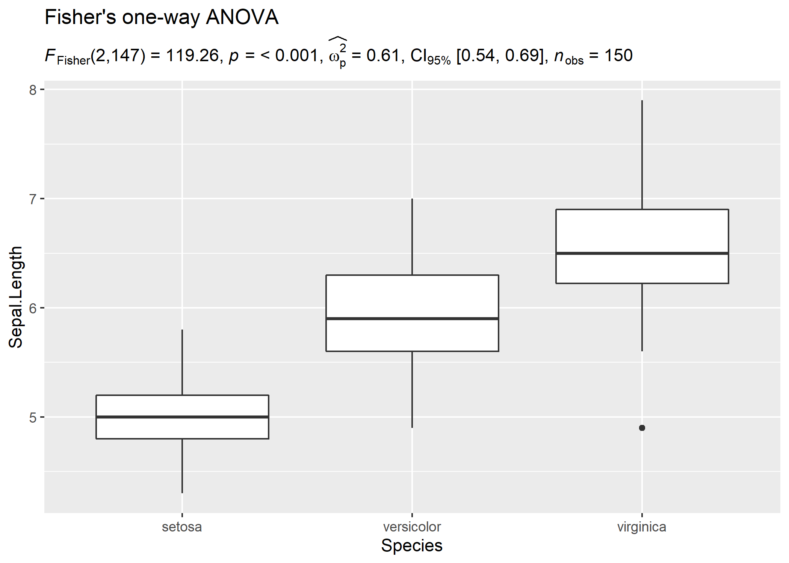

In case you change your mind and now want to carry out a robust ANOVA
instead. Also, let’s use a different kind of a visualization:

``` r
# setup
set.seed(123)
library(ggplot2)
library(statsExpressions)
library(ggridges)

# create a ridgeplot
ggplot(iris, aes(x = Sepal.Length, y = Species)) +
  geom_density_ridges(
    jittered_points = TRUE, quantile_lines = TRUE,
    scale = 0.9, vline_size = 1, vline_color = "red",
    position = position_raincloud(adjust_vlines = TRUE)
  ) + # use the expression in the dataframe to display results in the subtitle
  labs(
    title = "A heteroscedastic one-way ANOVA for trimmed means",
    subtitle = oneway_anova(iris, Species, Sepal.Length, type = "robust")$expression[[1]]
  )
```

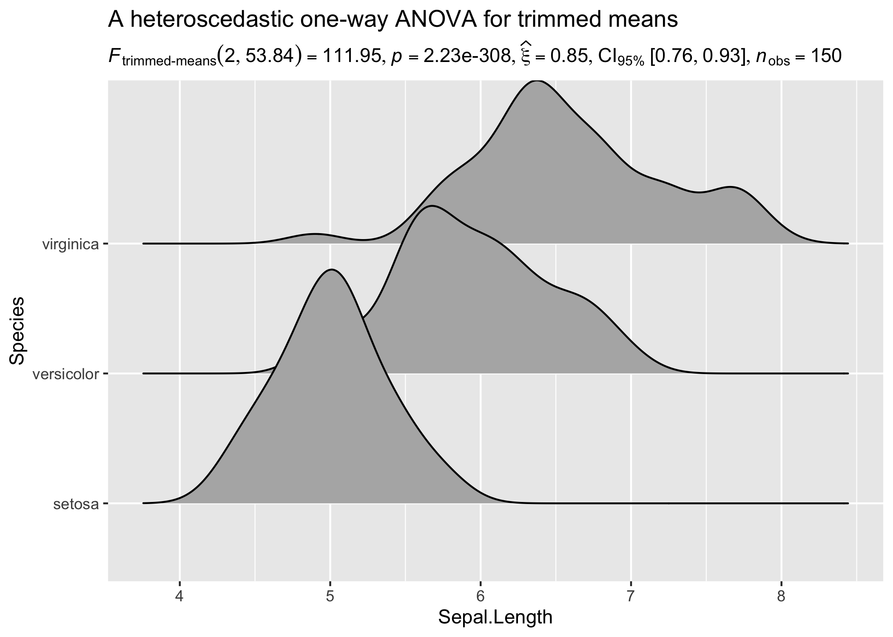

Needless to say, you can also use these functions to display results in
`ggplot`-extension packages. For example, `ggpubr`:

``` r
set.seed(123)
library(ggpubr)
library(ggplot2)

# plot
ggboxplot(
  ToothGrowth,
  x = "dose",
  y = "len",
  color = "dose",
  palette = c("#00AFBB", "#E7B800", "#FC4E07"),
  add = "jitter",
  shape = "dose"
) + # adding results from stats analysis using `statsExpressions`
  labs(
    title = "Kruskall-Wallis test",
    subtitle = oneway_anova(ToothGrowth, dose, len, type = "np")$expression[[1]]
  )
```

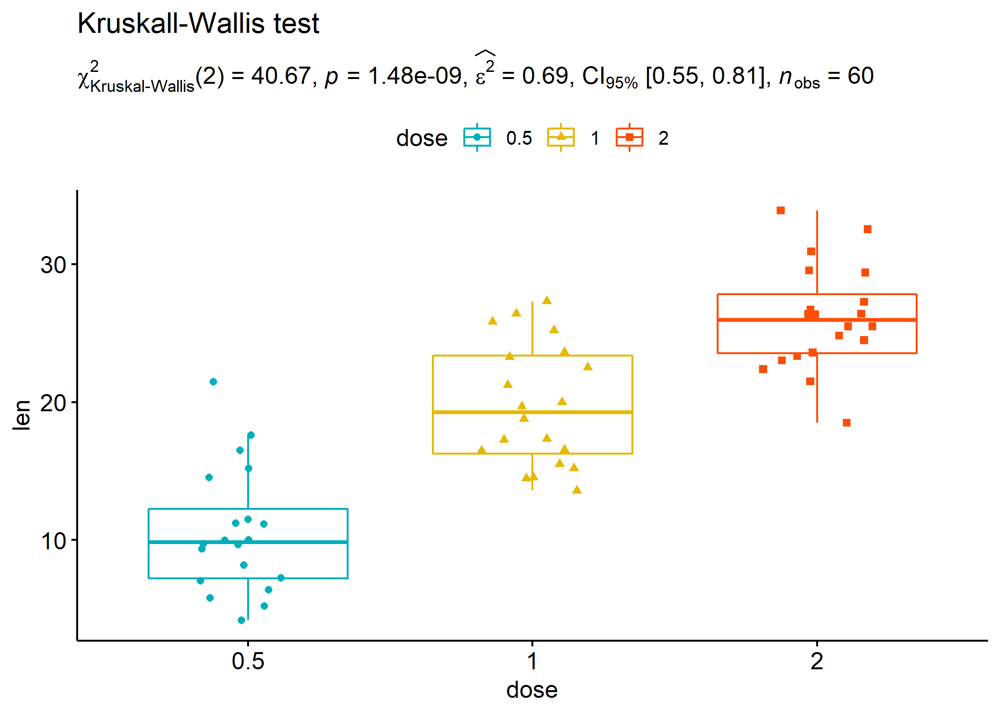

### Within-subjects design

Let’s now see an example of a repeated measures one-way ANOVA.

``` r
# setup
set.seed(123)
library(ggplot2)
library(WRS2)
library(ggbeeswarm)
library(statsExpressions)

ggplot2::ggplot(WineTasting, aes(Wine, Taste, color = Wine)) +
  geom_quasirandom() +
  labs(
    title = "Friedman's rank sum test",
    subtitle = oneway_anova(
      WineTasting,
      Wine,
      Taste,
      paired = TRUE,
      subject.id = Taster,
      type = "np"
    )$expression[[1]]
  )
```


## Example: Expressions for two-sample tests

### Between-subjects design

``` r
# setup
set.seed(123)
library(ggplot2)
library(gghalves)
library(ggbeeswarm)
library(hrbrthemes)
library(statsExpressions)

# create a plot
ggplot(ToothGrowth, aes(supp, len)) +
  geom_half_boxplot() +
  geom_beeswarm(beeswarmArgs = list(side = 1)) +
  theme_ipsum_rc() +
  # adding a subtitle with
  labs(
    title = "Two-Sample Welch's t-test",
    subtitle = two_sample_test(ToothGrowth, supp, len)$expression[[1]]
  )
```

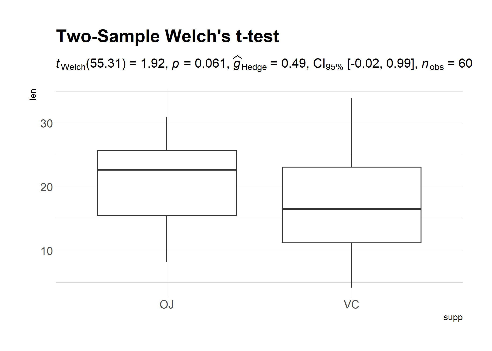

Example with `ggpubr`:

``` r
# setup
set.seed(123)
library(ggplot2)
library(ggpubr)
library(statsExpressions)

# basic plot
gghistogram(
  data.frame(
    sex = factor(rep(c("F", "M"), each = 200)),
    weight = c(rnorm(200, 55), rnorm(200, 58))
  ),
  x = "weight",
  add = "mean",
  rug = TRUE,
  fill = "sex",
  palette = c("#00AFBB", "#E7B800"),
  add_density = TRUE
) + # displaying stats results
  labs(
    title = "Yuen's two-sample test for trimmed means",
    subtitle = two_sample_test(
      data = data.frame(
        sex = factor(rep(c("F", "M"), each = 200)),
        weight = c(rnorm(200, 55), rnorm(200, 58))
      ),
      x = sex,
      y = weight,
      type = "robust"
    )$expression[[1]]
  )
```

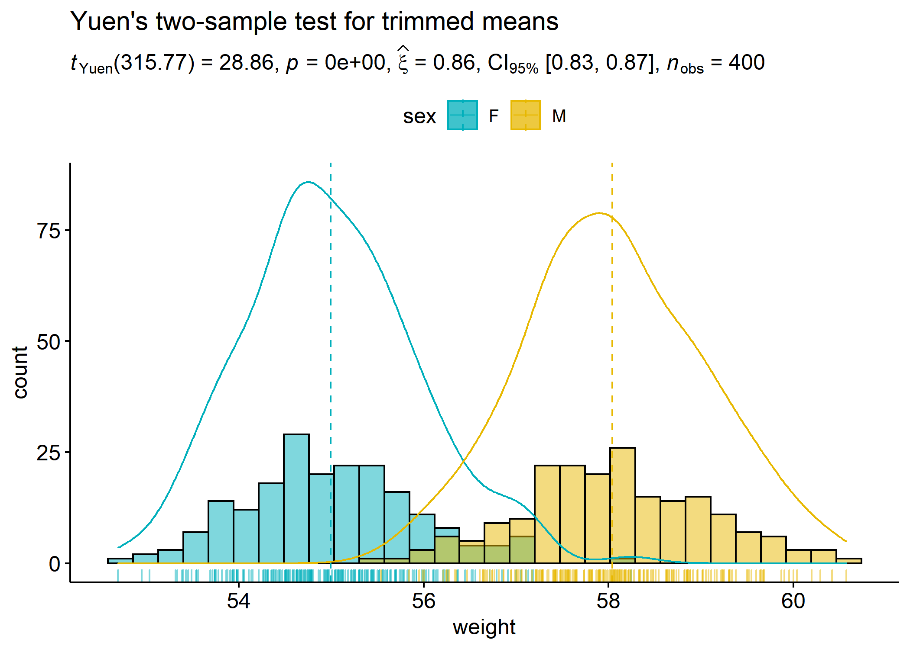

Another example with `ggiraphExtra`:

``` r
# setup
set.seed(123)
library(ggplot2)
library(ggiraphExtra)
library(gcookbook)
library(statsExpressions)

# plot
ggDot(heightweight, aes(sex, heightIn, fill = sex),
  boxfill = "white",
  binwidth = 0.4
) +
  labs(
    title = "Mann-Whitney test",
    subtitle = two_sample_test(heightweight, sex, heightIn, type = "nonparametric")$expression[[1]]
  )
```

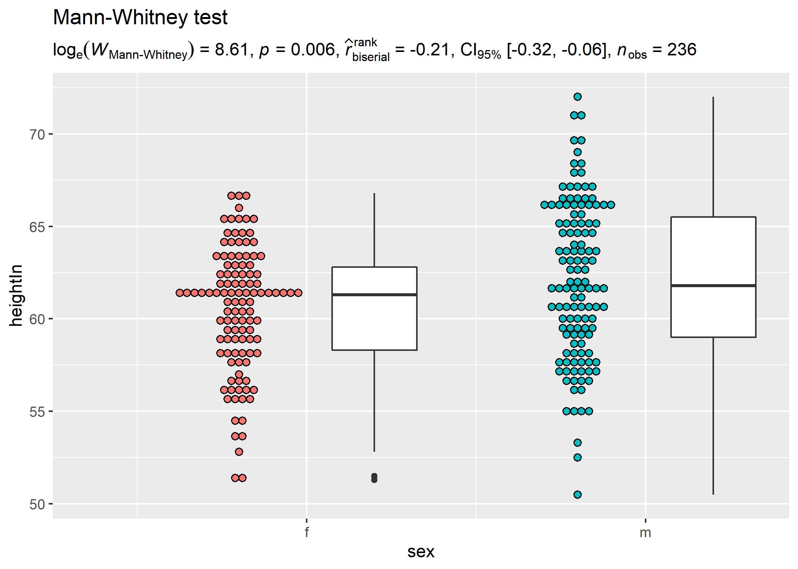

### Within-subjects design

We can also have a look at a repeated measures design and the related
expressions.

``` r
# setup
set.seed(123)
library(ggplot2)
library(statsExpressions)
library(tidyr)
library(PairedData)
data(PrisonStress)

# plot
paired.plotProfiles(PrisonStress, "PSSbefore", "PSSafter", subjects = "Subject") +
  # `statsExpressions` needs data in the tidy format
  labs(
    title = "Two-sample Wilcoxon paired test",
    subtitle = two_sample_test(
      data = pivot_longer(PrisonStress, starts_with("PSS"), "PSS", values_to = "stress"),
      x = PSS,
      y = stress,
      paired = TRUE,
      subject.id = Subject,
      type = "np"
    )$expression[[1]]
  )
```

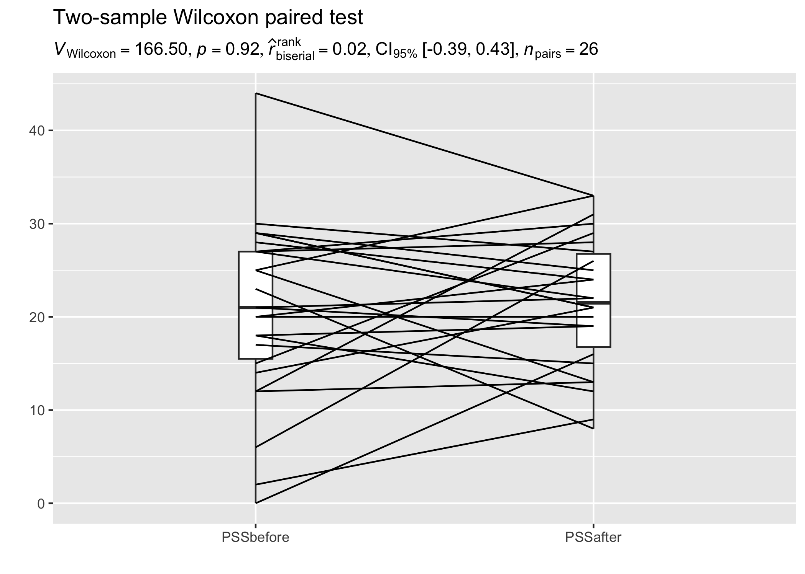

## Example: Expressions for one-sample tests

``` r
# setup
set.seed(123)
library(ggplot2)
library(statsExpressions)

# creating a histogram plot
ggplot(mtcars, aes(wt)) +
  geom_histogram(alpha = 0.5) +
  geom_vline(xintercept = mean(mtcars$wt), color = "red") +
  # adding a caption with a non-parametric one-sample test
  labs(
    title = "One-Sample Wilcoxon Signed Rank Test",
    subtitle = one_sample_test(mtcars, wt, test.value = 3, type = "nonparametric")$expression[[1]]
  )
```

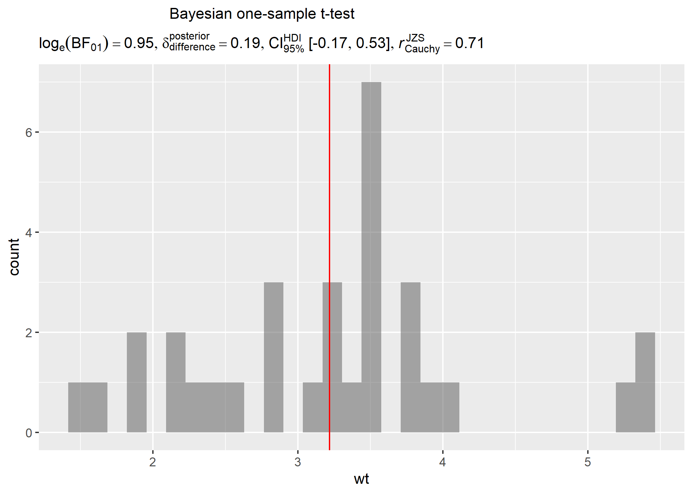

## Example: Expressions for correlation analyses

Let’s look at another example where we want to run correlation analysis:

``` r
# setup
set.seed(123)
library(ggplot2)
library(statsExpressions)

# create a scatter plot
ggplot(mtcars, aes(mpg, wt)) +
  geom_point() +
  geom_smooth(method = "lm", formula = y ~ x) +
  labs(
    title = "Spearman's rank correlation coefficient",
    subtitle = corr_test(mtcars, mpg, wt, type = "nonparametric")$expression[[1]]
  )
```

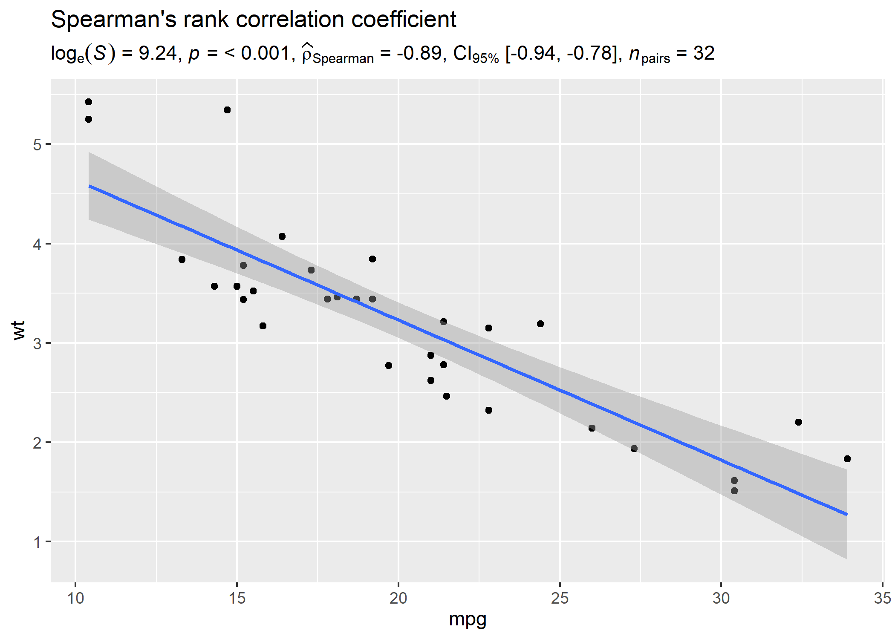

Another example

``` r
# setup
set.seed(123)
library(ggplot2)
library(ggExtra)
library(statsExpressions)

# basic plot
p <-
  ggplot(mtcars, aes(mpg, wt)) +
  geom_point() +
  geom_smooth(method = "lm") +
  labs(
    title = "Pearson's correlation coefficient",
    subtitle = corr_test(mtcars, mpg, wt, type = "parametric")$expression[[1]]
  )

# add
ggMarginal(p, type = "histogram", xparams = list(binwidth = 1, fill = "orange"))
```

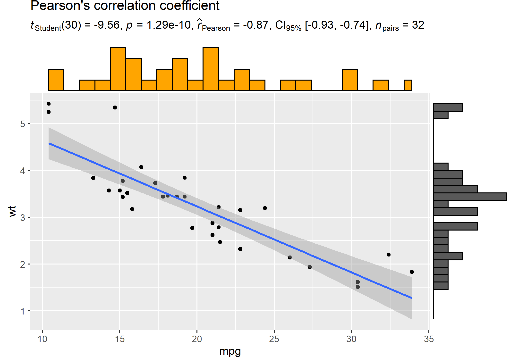

## Example: Expressions for contingency table analysis

For categorical/nominal data - one-sample:

``` r
# setup
set.seed(123)
library(ggplot2)
library(statsExpressions)

# basic pie chart
ggplot(as.data.frame(table(mpg$class)), aes(x = "", y = Freq, fill = factor(Var1))) +
  geom_bar(width = 1, stat = "identity") +
  theme(axis.line = element_blank()) +
  # cleaning up the chart and adding results from one-sample proportion test
  coord_polar(theta = "y", start = 0) +
  labs(
    fill = "Class",
    x = NULL,
    y = NULL,
    title = "Pie Chart of class (type of car)",
    subtitle = contingency_table(as.data.frame(table(mpg$class)), Var1, counts = Freq)$expression[[1]],
    caption = "One-sample goodness of fit proportion test"
  )
```


Another example of contingency tabs analysis:

``` r
# setup
set.seed(123)
library(moonBook)
library(ggiraphExtra)
library(statsExpressions)

# plot
ggSpine(
  data = acs,
  aes(x = Dx, fill = smoking),
  addlabel = TRUE,
  interactive = FALSE
) +
  labs(
    x = "diagnosis",
    title = "Pearson's chi-squared contingency table test for counts",
    subtitle = contingency_table(acs, Dx, smoking, paired = FALSE)$expression[[1]]
  )
```

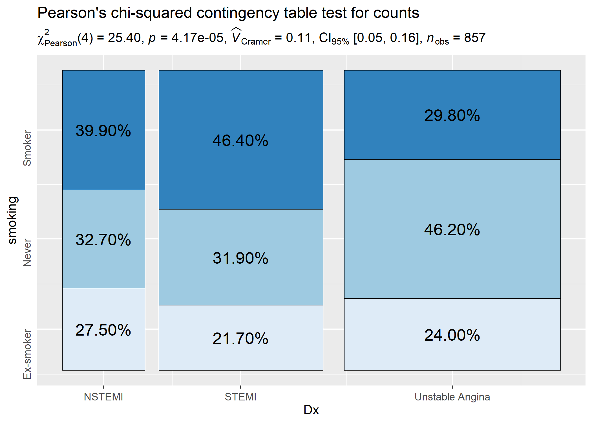

You can also use these function to get the expression in return without
having to display them in plots:

``` r
# setup
set.seed(123)
library(ggplot2)
library(statsExpressions)

# Pearson's chi-squared test of independence
contingency_table(mtcars, am, cyl)$expression[[1]]
#> paste(chi["Pearson"]^2, "(", "2", ") = ", "8.74", ", ", italic("p"), 
#>     " = ", "0.013", ", ", widehat(italic("V"))["Cramer"], " = ", 
#>     "0.46", ", CI"["95%"], " [", "0.00", ", ", "0.78", "]", ", ", 
#>     italic("n")["obs"], " = ", "32")
```

## Example: Expressions for meta-analysis

``` r
# setup
set.seed(123)
library(metaviz)
library(ggplot2)
library(metaplus)

# meta-analysis forest plot with results random-effects meta-analysis
viz_forest(
  x = mozart[, c("d", "se")],
  study_labels = mozart[, "study_name"],
  xlab = "Cohen's d",
  variant = "thick",
  type = "cumulative"
) + # use `statsExpressions` to create expression containing results
  labs(
    title = "Meta-analysis of Pietschnig, Voracek, and Formann (2010) on the Mozart effect",
    subtitle = meta_analysis(dplyr::rename(mozart, estimate = d, std.error = se))$expression[[1]]
  ) +
  theme(text = element_text(size = 12))
```

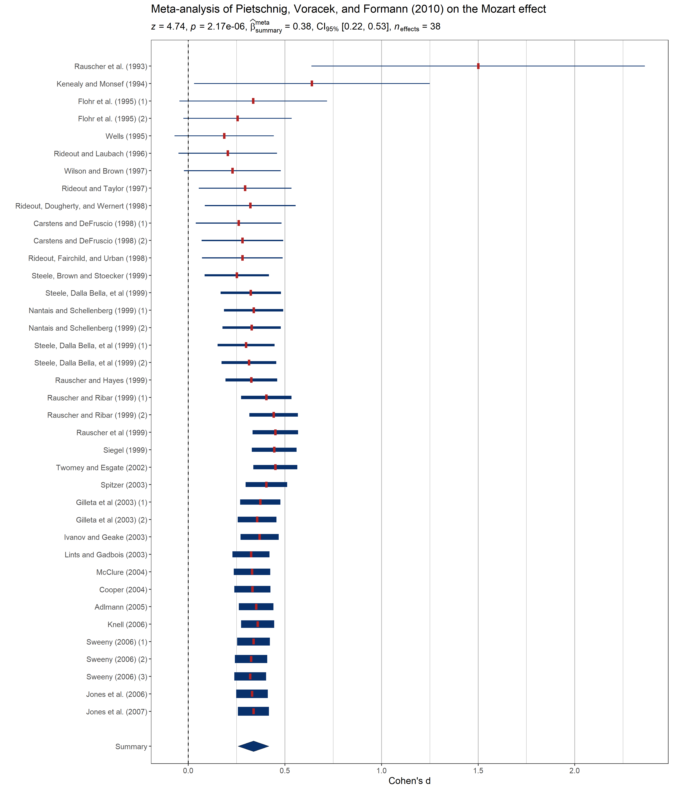

# Customizing details to your liking

Sometimes you may not wish include so many details in the subtitle. In
that case, you can extract the expression and copy-paste only the part
you wish to include. For example, here only statistic and *p*-values are
included:

``` r
# setup
set.seed(123)
library(ggplot2)
library(statsExpressions)

# extracting detailed expression
(res_expr <- oneway_anova(iris, Species, Sepal.Length, var.equal = TRUE)$expression[[1]])
#> paste(italic("F")["Fisher"], "(", "2", ",", "147", ") = ", "119.26", 
#>     ", ", italic("p"), " = ", "1.67e-31", ", ", widehat(omega["p"]^2), 
#>     " = ", "0.61", ", CI"["95%"], " [", "0.52", ", ", "0.68", 
#>     "]", ", ", italic("n")["obs"], " = ", "150")

# adapting the details to your liking
ggplot(iris, aes(x = Species, y = Sepal.Length)) +
  geom_boxplot() +
  labs(subtitle = ggplot2::expr(paste(
    NULL, italic("F"), "(", "2",
    ",", "147", ") = ", "119.26", ", ",
    italic("p"), " = ", "1.67e-31"
  )))
```

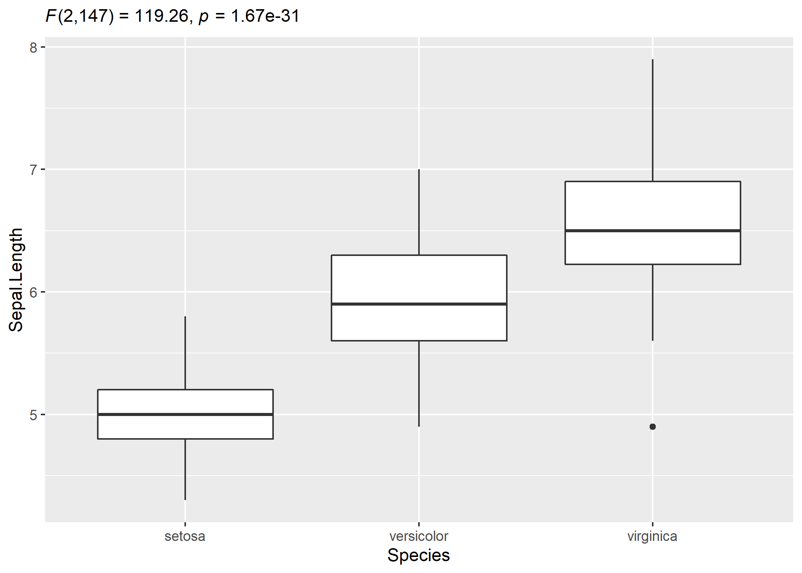

# Usage in `ggstatsplot`

Note that these functions were initially written to display results from
statistical tests on ready-made `ggplot2` plots implemented in
`ggstatsplot`.

For detailed documentation, see the package website:
<https://indrajeetpatil.github.io/ggstatsplot/>

Here is an example from `ggstatsplot` of what the plots look like when
the expressions are displayed in the subtitle-

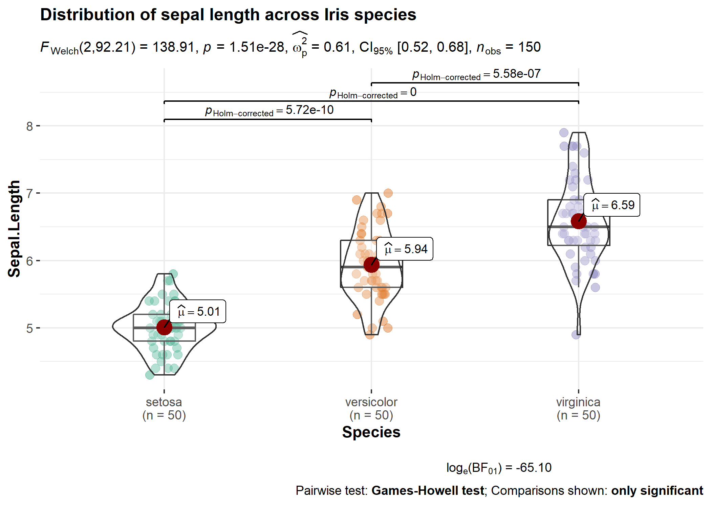

# Acknowledgments

The hexsticker was generously designed by Sarah Otterstetter (Max Planck
Institute for Human Development, Berlin).

# Code coverage

As the code stands right now, here is the code coverage for all primary
functions involved:
<https://codecov.io/gh/IndrajeetPatil/statsExpressions/tree/master/R>

# Contributing

I’m happy to receive bug reports, suggestions, questions, and (most of
all) contributions to fix problems and add features. I personally prefer
using the `GitHub` issues system over trying to reach out to me in other
ways (personal e-mail, Twitter, etc.). Pull Requests for contributions
are encouraged.

Here are some simple ways in which you can contribute (in the increasing
order of commitment):

-   Read and correct any inconsistencies in the
    [documentation](https://indrajeetpatil.github.io/statsExpressions/)

-   Raise issues about bugs or wanted features

-   Review code

-   Add new functionality (in the form of new plotting functions or
    helpers for preparing subtitles)

Please note that this project is released with a [Contributor Code of
Conduct](https://github.com/IndrajeetPatil/statsExpressions/blob/master/.github/CODE_OF_CONDUCT.md).
By participating in this project you agree to abide by its terms.
