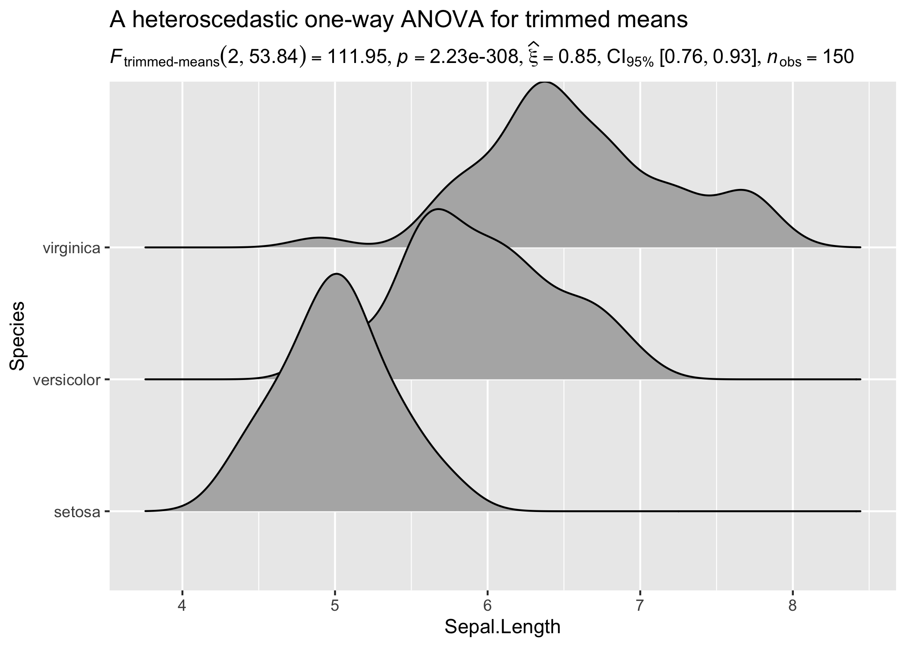
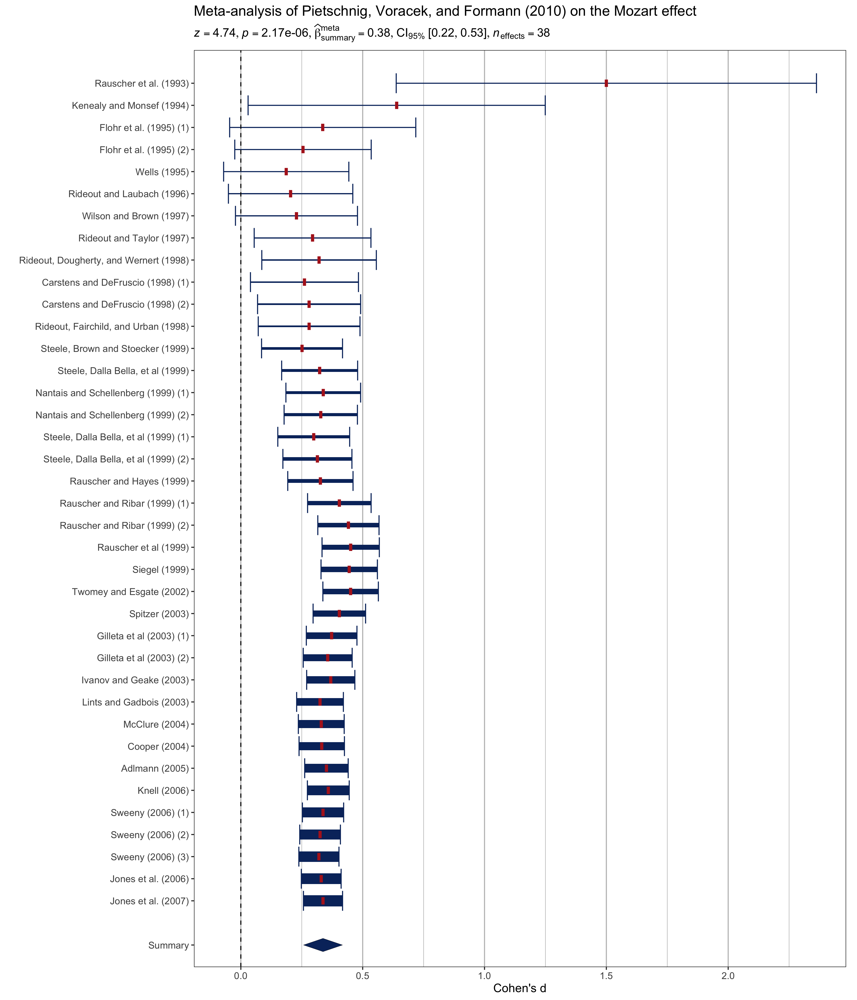

# `{statsExpressions}`: Tidy dataframes and expressions with statistical details

| Status | Usage | Miscellaneous |
|----|----|----|
| [](https://github.com/IndrajeetPatil/statsExpressions/actions) | [](https://CRAN.R-project.org/package=statsExpressions) | [](https://app.codecov.io/gh/IndrajeetPatil/statsExpressions?branch=main) |
| [](https://lifecycle.r-lib.org/articles/stages.html) | [](https://CRAN.R-project.org/package=statsExpressions) | [](https://doi.org/10.21105/joss.03236) |

# Introduction

The
[statsExpressions](https://indrajeetpatil.github.io/statsExpressions/)
package has two key aims:

- to provide a consistent syntax to do statistical analysis with tidy
  data (in pipe-friendly manner),
- to provide statistical expressions (pre-formatted in-text statistical
  results) for plotting functions.

Statistical packages exhibit substantial diversity in terms of their
syntax and expected input type. This can make it difficult to switch
from one statistical approach to another. For example, some functions
expect vectors as inputs, while others expect dataframes. Depending on
whether it is a repeated measures design or not, different functions
might expect data to be in wide or long format. Some functions can
internally omit missing values, while other functions error in their
presence. Furthermore, if someone wishes to utilize the objects returned
by these packages downstream in their workflow, this is not
straightforward either because even functions from the same package can
return a list, a matrix, an array, a dataframe, etc., depending on the
function.

This is where
[statsExpressions](https://indrajeetpatil.github.io/statsExpressions/)
comes in: It can be thought of as a unified portal through which most of
the functionality in these underlying packages can be accessed, with a
simpler interface and no requirement to change data format.

This package forms the statistical processing backend for
[`ggstatsplot`](https://indrajeetpatil.github.io/ggstatsplot/) package.

For more documentation, see the dedicated
[website](https://indrajeetpatil.github.io/statsExpressions/).

# Installation

| Type        | Command                                       |
|:------------|:----------------------------------------------|
| Release     | `install.packages("statsExpressions")`        |
| Development | `pak::pak("IndrajeetPatil/statsExpressions")` |

On Linux,
[statsExpressions](https://indrajeetpatil.github.io/statsExpressions/)
installation may require additional system dependencies, which can be
checked using:

``` r

pak::pkg_sysreqs("statsExpressions")
```

# Citation

The package can be cited as:

``` r
citation("statsExpressions")
To cite package 'statsExpressions' in publications use:

  Patil, I., (2021). statsExpressions: R Package for Tidy Dataframes
  and Expressions with Statistical Details. Journal of Open Source
  Software, 6(61), 3236, https://doi.org/10.21105/joss.03236

A BibTeX entry for LaTeX users is

  @Article{,
    doi = {10.21105/joss.03236},
    year = {2021},
    publisher = {{The Open Journal}},
    volume = {6},
    number = {61},
    pages = {3236},
    author = {Indrajeet Patil},
    title = {{statsExpressions: {R} Package for Tidy Dataframes and Expressions with Statistical Details}},
    journal = {{Journal of Open Source Software}},
  }
```

# General Workflow


# Summary of functionality

**Summary of available analyses**

| Test | Function |
|:---|:---|
| one-sample *t*-test | [`one_sample_test()`](https://indrajeetpatil.github.io/statsExpressions/reference/one_sample_test.md) |
| two-sample *t*-test | [`two_sample_test()`](https://indrajeetpatil.github.io/statsExpressions/reference/two_sample_test.md) |
| one-way ANOVA | [`oneway_anova()`](https://indrajeetpatil.github.io/statsExpressions/reference/oneway_anova.md) |
| correlation analysis | [`corr_test()`](https://indrajeetpatil.github.io/statsExpressions/reference/corr_test.md) |
| contingency table analysis | [`contingency_table()`](https://indrajeetpatil.github.io/statsExpressions/reference/contingency_table.md) |
| meta-analysis | [`meta_analysis()`](https://indrajeetpatil.github.io/statsExpressions/reference/meta_analysis.md) |
| pairwise comparisons | [`pairwise_comparisons()`](https://indrajeetpatil.github.io/statsExpressions/reference/pairwise_comparisons.md) |

**Summary of details available for analyses**

| Analysis                        | Hypothesis testing | Effect size estimation |
|:--------------------------------|:-------------------|:-----------------------|
| (one/two-sample) *t*-test       | ✅                 | ✅                     |
| one-way ANOVA                   | ✅                 | ✅                     |
| correlation                     | ✅                 | ✅                     |
| (one/two-way) contingency table | ✅                 | ✅                     |
| random-effects meta-analysis    | ✅                 | ✅                     |

**Summary of supported statistical approaches**

| Description | Parametric | Non-parametric | Robust | Bayesian |
|:---|:---|:---|:---|:---|
| Between group/condition comparisons | ✅ | ✅ | ✅ | ✅ |
| Within group/condition comparisons | ✅ | ✅ | ✅ | ✅ |
| Distribution of a numeric variable | ✅ | ✅ | ✅ | ✅ |
| Correlation between two variables | ✅ | ✅ | ✅ | ✅ |
| Association between categorical variables | ✅ | ✅ | ❌ | ✅ |
| Equal proportions for categorical variable levels | ✅ | ✅ | ❌ | ✅ |
| Random-effects meta-analysis | ✅ | ❌ | ✅ | ✅ |

# Tidy dataframes from statistical analysis

To illustrate the simplicity of this syntax, let’s say we want to run a
one-way ANOVA. If we first run a non-parametric ANOVA and then decide to
run a robust ANOVA instead, the syntax remains the same and the
statistical approach can be modified by changing a single argument:

``` r

mtcars %>% oneway_anova(cyl, wt, type = "nonparametric")
#> # A tibble: 1 × 15
#>   parameter1 parameter2 statistic df.error   p.value
#>   <chr>      <chr>          <dbl>    <int>     <dbl>
#> 1 wt         cyl             22.8        2 0.0000112
#>   method                       effectsize      estimate conf.level conf.low
#>   <chr>                        <chr>              <dbl>      <dbl>    <dbl>
#> 1 Kruskal-Wallis rank sum test Epsilon2 (rank)    0.736       0.95    0.624
#>   conf.high conf.method          conf.iterations n.obs expression
#>       <dbl> <chr>                          <int> <int> <list>    
#> 1         1 percentile bootstrap             100    32 <language>

mtcars %>% oneway_anova(cyl, wt, type = "robust")
#> # A tibble: 1 × 12
#>   statistic    df df.error p.value
#>       <dbl> <dbl>    <dbl>   <dbl>
#> 1      12.7     2     12.2 0.00102
#>   method                                           
#>   <chr>                                            
#> 1 A heteroscedastic one-way ANOVA for trimmed means
#>   effectsize                         estimate conf.level conf.low conf.high
#>   <chr>                                 <dbl>      <dbl>    <dbl>     <dbl>
#> 1 Explanatory measure of effect size     1.05       0.95    0.843      1.50
#>   n.obs expression
#>   <int> <list>    
#> 1    32 <language>
```

All possible output dataframes from functions are tabulated here:
<https://indrajeetpatil.github.io/statsExpressions/articles/web_only/dataframe_outputs.html>

Needless to say this will also work with the `kable` function to
generate a table:

``` r

set.seed(123)

# one-sample robust t-test
# we will leave `expression` column out; it's not needed for using only the dataframe
mtcars %>%
  one_sample_test(wt, test.value = 3, type = "robust") %>%
  dplyr::select(-expression) %>%
  knitr::kable()
```

| statistic | p.value | n.obs | method | effectsize | estimate | conf.level | conf.low | conf.high |
|---:|---:|---:|:---|:---|---:|---:|---:|---:|
| 1.179181 | 0.275 | 32 | Bootstrap-t method for one-sample test | Trimmed mean | 3.197 | 0.95 | 2.854246 | 3.539754 |

These functions are also compatible with other popular data manipulation
packages.

For example, let’s say we want to run a one-sample *t*-test for all
levels of a certain grouping variable. We can use `dplyr` to do so:

``` r

# for reproducibility
set.seed(123)
library(dplyr)

# grouped operation
# running one-sample test for all levels of grouping variable `cyl`
mtcars %>%
  group_by(cyl) %>%
  group_modify(~ one_sample_test(.x, wt, test.value = 3), .keep = TRUE) %>%
  ungroup()
#> # A tibble: 3 × 16
#>     cyl    mu statistic df.error  p.value method            alternative
#>   <dbl> <dbl>     <dbl>    <dbl>    <dbl> <chr>             <chr>      
#> 1     4     3    -4.16        10 0.00195  One Sample t-test two.sided  
#> 2     6     3     0.870        6 0.418    One Sample t-test two.sided  
#> 3     8     3     4.92        13 0.000278 One Sample t-test two.sided  
#>   effectsize estimate conf.level conf.low conf.high conf.method
#>   <chr>         <dbl>      <dbl>    <dbl>     <dbl> <chr>      
#> 1 Hedges' g    -1.16        0.95   -1.88     -0.402 ncp        
#> 2 Hedges' g     0.286       0.95   -0.388     0.937 ncp        
#> 3 Hedges' g     1.24        0.95    0.544     1.91  ncp        
#>   conf.distribution n.obs expression
#>   <chr>             <int> <list>    
#> 1 t                    11 <language>
#> 2 t                     7 <language>
#> 3 t                    14 <language>
```

# Using expressions in custom plots

Note that *expression* here means **a pre-formatted in-text statistical
result**. In addition to other details contained in the dataframe, there
is also a column titled `expression`, which contains expression with
statistical details and can be displayed in a plot.

For **all** statistical test expressions, the default template attempt
to follow the gold standard for statistical reporting.

For example, here are results from Welch’s *t*-test:


Let’s load the needed library for visualization:

``` r

library(ggplot2)
```

## Expressions for centrality measure

**Note that when used in a geometric layer, the expression need to be
parsed.**

``` r

# displaying mean for each level of `cyl`
centrality_description(mtcars, cyl, wt) |>
  ggplot(aes(cyl, wt)) +
  geom_point() +
  geom_label(aes(label = expression), parse = TRUE)
```


Here are a few examples for supported analyses.

## Expressions for one-way ANOVAs

The returned data frame will always have a column called `expression`.

Assuming there is only a single result you need to display in a plot, to
use it in a plot, you have two options:

- extract the expression from the list column
  (`results_data$expression[[1]]`) without parsing
- use the list column as is, in which case you will need to parse it
  (`parse(text = results_data$expression)`)

If you want to display more than one expression in a plot, you will
*have to* parse them.

### Between-subjects design

``` r

set.seed(123)
library(ggridges)

results_data <- oneway_anova(iris, Species, Sepal.Length, type = "robust")

# create a ridgeplot
ggplot(iris, aes(x = Sepal.Length, y = Species)) +
  geom_density_ridges() +
  labs(
    title = "A heteroscedastic one-way ANOVA for trimmed means",
    subtitle = results_data$expression[[1]]
  )
```



### Within-subjects design

``` r

set.seed(123)
library(WRS2)
library(ggbeeswarm)

results_data <- oneway_anova(
  WineTasting,
  Wine,
  Taste,
  paired = TRUE,
  subject.id = Taster,
  type = "np"
)

ggplot2::ggplot(WineTasting, aes(Wine, Taste, color = Wine)) +
  geom_quasirandom() +
  labs(
    title = "Friedman's rank sum test",
    subtitle = parse(text = results_data$expression)
  )
```


## Expressions for two-sample tests

### Between-subjects design

``` r

set.seed(123)
library(gghalves)

results_data <- two_sample_test(ToothGrowth, supp, len)

ggplot(ToothGrowth, aes(supp, len)) +
  geom_half_dotplot() +
  labs(
    title = "Two-Sample Welch's t-test",
    subtitle = parse(text = results_data$expression)
  )
```


### Within-subjects design

``` r

set.seed(123)
library(tidyr)
library(PairedData)
data(PrisonStress)

# get data in tidy format
df <- pivot_longer(PrisonStress, starts_with("PSS"), names_to = "PSS", values_to = "stress")

results_data <- two_sample_test(
  data = df,
  x = PSS,
  y = stress,
  paired = TRUE,
  subject.id = Subject,
  type = "np"
)

# plot
suppressWarnings(paired.plotProfiles(
  PrisonStress, "PSSbefore", "PSSafter",
  subjects = "Subject"
)) +
  labs(
    title = "Two-sample Wilcoxon paired test",
    subtitle = parse(text = results_data$expression)
  )
```


## Expressions for one-sample tests

``` r

set.seed(123)

# dataframe with results
results_data <- one_sample_test(mtcars, wt, test.value = 3, type = "bayes")

# creating a histogram plot
ggplot(mtcars, aes(wt)) +
  geom_histogram(alpha = 0.5) +
  geom_vline(xintercept = mean(mtcars$wt), color = "red") +
  labs(subtitle = parse(text = results_data$expression))
```


## Expressions for correlation analysis

Let’s look at another example where we want to run correlation analysis:

``` r

set.seed(123)

# dataframe with results
results_data <- corr_test(mtcars, mpg, wt, type = "nonparametric")

# create a scatter plot
ggplot(mtcars, aes(mpg, wt)) +
  geom_point() +
  geom_smooth(method = "lm", formula = y ~ x) +
  labs(
    title = "Spearman's rank correlation coefficient",
    subtitle = parse(text = results_data$expression)
  )
```


## Expressions for contingency table analysis

For categorical/nominal data - one-sample:

``` r

set.seed(123)

# dataframe with results
results_data <- contingency_table(
  as.data.frame(table(mpg$class)),
  Var1,
  counts = Freq,
  type = "bayes"
)

# create a pie chart
ggplot(as.data.frame(table(mpg$class)), aes(x = "", y = Freq, fill = factor(Var1))) +
  geom_bar(width = 1, stat = "identity") +
  theme(axis.line = element_blank()) +
  # cleaning up the chart and adding results from one-sample proportion test
  coord_polar(theta = "y", start = 0) +
  labs(
    fill = "Class",
    x = NULL,
    y = NULL,
    title = "Pie Chart of class (type of car)",
    caption = parse(text = results_data$expression)
  )
```


You can also use these function to get the expression in return without
having to display them in plots:

``` r

set.seed(123)

# Pearson's chi-squared test of independence
contingency_table(mtcars, am, vs)$expression[[1]]
#> list(chi["Pearson"]^2 * "(" * 1 * ")" == "0.91", italic(p) == 
#>     "0.34", widehat(italic("V"))["Cramer"] == "0.00", CI["95%"] ~ 
#>     "[" * "0.00", "0.49" * "]", italic("n")["obs"] == "32")
```

## Expressions for meta-analysis

``` r

set.seed(123)
library(metaviz)

# dataframe with results
results_data <- meta_analysis(dplyr::rename(mozart, estimate = d, std.error = se))

# meta-analysis forest plot with results random-effects meta-analysis
suppressWarnings(viz_forest(
  x = mozart[, c("d", "se")],
  study_labels = mozart[, "study_name"],
  xlab = "Cohen's d",
  variant = "thick",
  type = "cumulative"
)) +
  labs(
    title = "Meta-analysis of Pietschnig, Voracek, and Formann (2010) on the Mozart effect",
    subtitle = parse(text = results_data$expression)
  ) +
  theme(text = element_text(size = 12))
```



# Customizing details to your liking

Sometimes you may not wish include so many details in the subtitle. In
that case, you can extract the expression and copy-paste only the part
you wish to include. For example, here only statistic and *p*-values are
included:

``` r

set.seed(123)

# extracting detailed expression
(res_expr <- oneway_anova(iris, Species, Sepal.Length, var.equal = TRUE)$expression[[1]])
#> list(italic("F")["Fisher"](2, 147) == "119.26", italic(p) == 
#>     "1.67e-31", widehat(omega["p"]^2) == "0.61", CI["95%"] ~ 
#>     "[" * "0.53", "1.00" * "]", italic("n")["obs"] == "150")

# adapting the details to your liking
ggplot(iris, aes(x = Species, y = Sepal.Length)) +
  geom_boxplot() +
  labs(subtitle = ggplot2::expr(paste(
    NULL, italic("F"), "(", "2", ",", "147", ") = ", "119.26", ", ",
    italic("p"), " = ", "1.67e-31"
  )))
```


# Summary of tests and effect sizes

Here a go-to summary about statistical test carried out and the returned
effect size for each function is provided. This should be useful if one
needs to find out more information about how an argument is resolved in
the underlying package or if one wishes to browse the source code. So,
for example, if you want to know more about how one-way
(between-subjects) ANOVA, you can run
[`?stats::oneway.test`](https://rdrr.io/r/stats/oneway.test.html) in
your R console.

## `centrality_description`

| Type | Measure | Function used |
|:---|:---|:---|
| Parametric | mean | [`datawizard::describe_distribution()`](https://easystats.github.io/datawizard/reference/describe_distribution.html) |
| Non-parametric | median | [`datawizard::describe_distribution()`](https://easystats.github.io/datawizard/reference/describe_distribution.html) |
| Robust | trimmed mean | [`datawizard::describe_distribution()`](https://easystats.github.io/datawizard/reference/describe_distribution.html) |
| Bayesian | MAP | [`datawizard::describe_distribution()`](https://easystats.github.io/datawizard/reference/describe_distribution.html) |

## `oneway_anova`

#### between-subjects

**Hypothesis testing**

| Type | No. of groups | Test | Function used |
|:---|:---|:---|:---|
| Parametric | \> 2 | Fisher’s or Welch’s one-way ANOVA | [`stats::oneway.test()`](https://rdrr.io/r/stats/oneway.test.html) |
| Non-parametric | \> 2 | Kruskal-Wallis one-way ANOVA | [`stats::kruskal.test()`](https://rdrr.io/r/stats/kruskal.test.html) |
| Robust | \> 2 | Heteroscedastic one-way ANOVA for trimmed means | [`WRS2::t1way()`](https://rdrr.io/pkg/WRS2/man/t1way.html) |
| Bayes Factor | \> 2 | Fisher’s ANOVA | [`BayesFactor::anovaBF()`](https://rdrr.io/pkg/BayesFactor/man/anovaBF.html) |

**Effect size estimation**

| Type | No. of groups | Effect size | CI available? | Function used |
|:---|:---|:---|:---|:---|
| Parametric | \> 2 | partial eta-squared, partial omega-squared | Yes | [`effectsize::omega_squared()`](https://easystats.github.io/effectsize/reference/eta_squared.html), [`effectsize::eta_squared()`](https://easystats.github.io/effectsize/reference/eta_squared.html) |
| Non-parametric | \> 2 | rank epsilon squared | Yes | [`effectsize::rank_epsilon_squared()`](https://easystats.github.io/effectsize/reference/rank_epsilon_squared.html) |
| Robust | \> 2 | Explanatory measure of effect size | Yes | [`WRS2::t1way()`](https://rdrr.io/pkg/WRS2/man/t1way.html) |
| Bayes Factor | \> 2 | Bayesian R-squared | Yes | [`performance::r2_bayes()`](https://easystats.github.io/performance/reference/r2_bayes.html) |

#### within-subjects

**Hypothesis testing**

| Type | No. of groups | Test | Function used |
|:---|:---|:---|:---|
| Parametric | \> 2 | One-way repeated measures ANOVA | [`afex::aov_ez()`](https://rdrr.io/pkg/afex/man/aov_car.html) |
| Non-parametric | \> 2 | Friedman rank sum test | [`stats::friedman.test()`](https://rdrr.io/r/stats/friedman.test.html) |
| Robust | \> 2 | Heteroscedastic one-way repeated measures ANOVA for trimmed means | [`WRS2::rmanova()`](https://rdrr.io/pkg/WRS2/man/rmanova.html) |
| Bayes Factor | \> 2 | One-way repeated measures ANOVA | [`BayesFactor::anovaBF()`](https://rdrr.io/pkg/BayesFactor/man/anovaBF.html) |

**Effect size estimation**

| Type | No. of groups | Effect size | CI available? | Function used |
|:---|:---|:---|:---|:---|
| Parametric | \> 2 | partial eta-squared, partial omega-squared | Yes | [`effectsize::omega_squared()`](https://easystats.github.io/effectsize/reference/eta_squared.html), [`effectsize::eta_squared()`](https://easystats.github.io/effectsize/reference/eta_squared.html) |
| Non-parametric | \> 2 | Kendall’s coefficient of concordance | Yes | [`effectsize::kendalls_w()`](https://easystats.github.io/effectsize/reference/rank_epsilon_squared.html) |
| Robust | \> 2 | Algina-Keselman-Penfield robust standardized difference average | Yes | [`WRS2::wmcpAKP()`](https://rdrr.io/pkg/WRS2/man/wmcpAKP.html) |
| Bayes Factor | \> 2 | Bayesian R-squared | Yes | [`performance::r2_bayes()`](https://easystats.github.io/performance/reference/r2_bayes.html) |

## `two_sample_test`

#### between-subjects

**Hypothesis testing**

| Type | No. of groups | Test | Function used |
|:---|:---|:---|:---|
| Parametric | 2 | Student’s or Welch’s *t*-test | [`stats::t.test()`](https://rdrr.io/r/stats/t.test.html) |
| Non-parametric | 2 | Mann-Whitney *U* test | [`stats::wilcox.test()`](https://rdrr.io/r/stats/wilcox.test.html) |
| Robust | 2 | Yuen’s test for trimmed means | [`WRS2::yuen()`](https://rdrr.io/pkg/WRS2/man/yuen.html) |
| Bayesian | 2 | Student’s *t*-test | [`BayesFactor::ttestBF()`](https://rdrr.io/pkg/BayesFactor/man/ttestBF.html) |

**Effect size estimation**

| Type | No. of groups | Effect size | CI available? | Function used |
|:---|:---|:---|:---|:---|
| Parametric | 2 | Cohen’s *d*, Hedge’s *g* | Yes | [`effectsize::cohens_d()`](https://easystats.github.io/effectsize/reference/cohens_d.html), [`effectsize::hedges_g()`](https://easystats.github.io/effectsize/reference/cohens_d.html) |
| Non-parametric | 2 | *r* (rank-biserial correlation) | Yes | [`effectsize::rank_biserial()`](https://easystats.github.io/effectsize/reference/rank_biserial.html) |
| Robust | 2 | Algina-Keselman-Penfield robust standardized difference | Yes | [`WRS2::akp.effect()`](https://rdrr.io/pkg/WRS2/man/yuen.html) |
| Bayesian | 2 | difference | Yes | [`bayestestR::describe_posterior()`](https://easystats.github.io/bayestestR/reference/describe_posterior.html) |

#### within-subjects

**Hypothesis testing**

| Type | No. of groups | Test | Function used |
|:---|:---|:---|:---|
| Parametric | 2 | Student’s *t*-test | [`stats::t.test()`](https://rdrr.io/r/stats/t.test.html) |
| Non-parametric | 2 | Wilcoxon signed-rank test | [`stats::wilcox.test()`](https://rdrr.io/r/stats/wilcox.test.html) |
| Robust | 2 | Yuen’s test on trimmed means for dependent samples | [`WRS2::yuend()`](https://rdrr.io/pkg/WRS2/man/yuend.html) |
| Bayesian | 2 | Student’s *t*-test | [`BayesFactor::ttestBF()`](https://rdrr.io/pkg/BayesFactor/man/ttestBF.html) |

**Effect size estimation**

| Type | No. of groups | Effect size | CI available? | Function used |
|:---|:---|:---|:---|:---|
| Parametric | 2 | Cohen’s *d*, Hedge’s *g* | Yes | [`effectsize::cohens_d()`](https://easystats.github.io/effectsize/reference/cohens_d.html), [`effectsize::hedges_g()`](https://easystats.github.io/effectsize/reference/cohens_d.html) |
| Non-parametric | 2 | *r* (rank-biserial correlation) | Yes | [`effectsize::rank_biserial()`](https://easystats.github.io/effectsize/reference/rank_biserial.html) |
| Robust | 2 | Algina-Keselman-Penfield robust standardized difference | Yes | [`WRS2::wmcpAKP()`](https://rdrr.io/pkg/WRS2/man/wmcpAKP.html) |
| Bayesian | 2 | difference | Yes | [`bayestestR::describe_posterior()`](https://easystats.github.io/bayestestR/reference/describe_posterior.html) |

## `one_sample_test`

**Hypothesis testing**

| Type | Test | Function used |
|:---|:---|:---|
| Parametric | One-sample Student’s *t*-test | [`stats::t.test()`](https://rdrr.io/r/stats/t.test.html) |
| Non-parametric | One-sample Wilcoxon test | [`stats::wilcox.test()`](https://rdrr.io/r/stats/wilcox.test.html) |
| Robust | Bootstrap-*t* method for one-sample test | [`WRS2::trimcibt()`](https://rdrr.io/pkg/WRS2/man/trimcibt.html) |
| Bayesian | One-sample Student’s *t*-test | [`BayesFactor::ttestBF()`](https://rdrr.io/pkg/BayesFactor/man/ttestBF.html) |

**Effect size estimation**

| Type | Effect size | CI available? | Function used |
|:---|:---|:---|:---|
| Parametric | Cohen’s *d*, Hedge’s *g* | Yes | [`effectsize::cohens_d()`](https://easystats.github.io/effectsize/reference/cohens_d.html), [`effectsize::hedges_g()`](https://easystats.github.io/effectsize/reference/cohens_d.html) |
| Non-parametric | *r* (rank-biserial correlation) | Yes | [`effectsize::rank_biserial()`](https://easystats.github.io/effectsize/reference/rank_biserial.html) |
| Robust | trimmed mean | Yes | [`WRS2::trimcibt()`](https://rdrr.io/pkg/WRS2/man/trimcibt.html) |
| Bayes Factor | difference | Yes | [`bayestestR::describe_posterior()`](https://easystats.github.io/bayestestR/reference/describe_posterior.html) |

## `corr_test`

**Hypothesis testing** and **Effect size estimation**

| Type | Test | CI available? | Function used |
|:---|:---|:---|:---|
| Parametric | Pearson’s correlation coefficient | Yes | [`correlation::correlation()`](https://easystats.github.io/correlation/reference/correlation.html) |
| Non-parametric | Spearman’s rank correlation coefficient | Yes | [`correlation::correlation()`](https://easystats.github.io/correlation/reference/correlation.html) |
| Robust | Winsorized Pearson’s correlation coefficient | Yes | [`correlation::correlation()`](https://easystats.github.io/correlation/reference/correlation.html) |
| Bayesian | Bayesian Pearson’s correlation coefficient | Yes | [`correlation::correlation()`](https://easystats.github.io/correlation/reference/correlation.html) |

## `contingency_table`

#### two-way table

**Hypothesis testing**

| Type | Design | Test | Function used |
|:---|:---|:---|:---|
| Parametric/Non-parametric | Unpaired | Pearson’s chi-squared test | [`stats::chisq.test()`](https://rdrr.io/r/stats/chisq.test.html) |
| Bayesian | Unpaired | Bayesian Pearson’s chi-squared test | [`BayesFactor::contingencyTableBF()`](https://rdrr.io/pkg/BayesFactor/man/contingencyTableBF.html) |
| Parametric/Non-parametric | Paired | McNemar’s chi-squared test | [`stats::mcnemar.test()`](https://rdrr.io/r/stats/mcnemar.test.html) |
| Bayesian | Paired | No | No |

**Effect size estimation**

| Type | Design | Effect size | CI available? | Function used |
|:---|:---|:---|:---|:---|
| Parametric/Non-parametric | Unpaired | Cramer’s *V* | Yes | [`effectsize::cramers_v()`](https://easystats.github.io/effectsize/reference/phi.html) |
| Bayesian | Unpaired | Cramer’s *V* | Yes | [`effectsize::cramers_v()`](https://easystats.github.io/effectsize/reference/phi.html) |
| Parametric/Non-parametric | Paired | Cohen’s *g* | Yes | [`effectsize::cohens_g()`](https://easystats.github.io/effectsize/reference/cohens_g.html) |
| Bayesian | Paired | No | No | No |

#### one-way table

**Hypothesis testing**

| Type | Test | Function used |
|:---|:---|:---|
| Parametric/Non-parametric | Goodness of fit chi-squared test | [`stats::chisq.test()`](https://rdrr.io/r/stats/chisq.test.html) |
| Bayesian | Bayesian Goodness of fit chi-squared test | (custom) |

**Effect size estimation**

| Type | Effect size | CI available? | Function used |
|:---|:---|:---|:---|
| Parametric/Non-parametric | Pearson’s *C* | Yes | [`effectsize::pearsons_c()`](https://easystats.github.io/effectsize/reference/phi.html) |
| Bayesian | No | No | No |

## `meta_analysis`

**Hypothesis testing** and **Effect size estimation**

| Type | Test | Effect size | CI available? | Function used |
|:---|:---|:---|:---|:---|
| Parametric | Meta-analysis via random-effects models | *beta* | Yes | [`metafor::metafor()`](https://wviechtb.github.io/metafor/reference/metafor-package.html) |
| Robust | Meta-analysis via robust random-effects models | *beta* | Yes | [`metaplus::metaplus()`](https://rdrr.io/pkg/metaplus/man/metaplus.html) |
| Bayes | Meta-analysis via Bayesian random-effects models | *beta* | Yes | [`metaBMA::meta_random()`](https://danheck.github.io/metaBMA/reference/meta_random.html) |

# Usage in `{ggstatsplot}`

Note that these functions were initially written to display results from
statistical tests on ready-made [ggplot2](https://ggplot2.tidyverse.org)
plots implemented in
[ggstatsplot](https://indrajeetpatil.github.io/ggstatsplot/).

For detailed documentation, see the package website:
<https://indrajeetpatil.github.io/ggstatsplot/>

Here is an example from
[ggstatsplot](https://indrajeetpatil.github.io/ggstatsplot/) of what the
plots look like when the expressions are displayed in the subtitle-


# Acknowledgments

The hexsticker and the schematic illustration of general workflow were
generously designed by Sarah Otterstetter (Max Planck Institute for
Human Development, Berlin).

# Contributing

Bug reports, suggestions, questions, and (most of all) contributions are
welcome.

Please note that this project is released with a [Contributor Code of
Conduct](https://github.com/IndrajeetPatil/statsExpressions/blob/main/.github/CODE_OF_CONDUCT.md).
By participating in this project you agree to abide by its terms.
