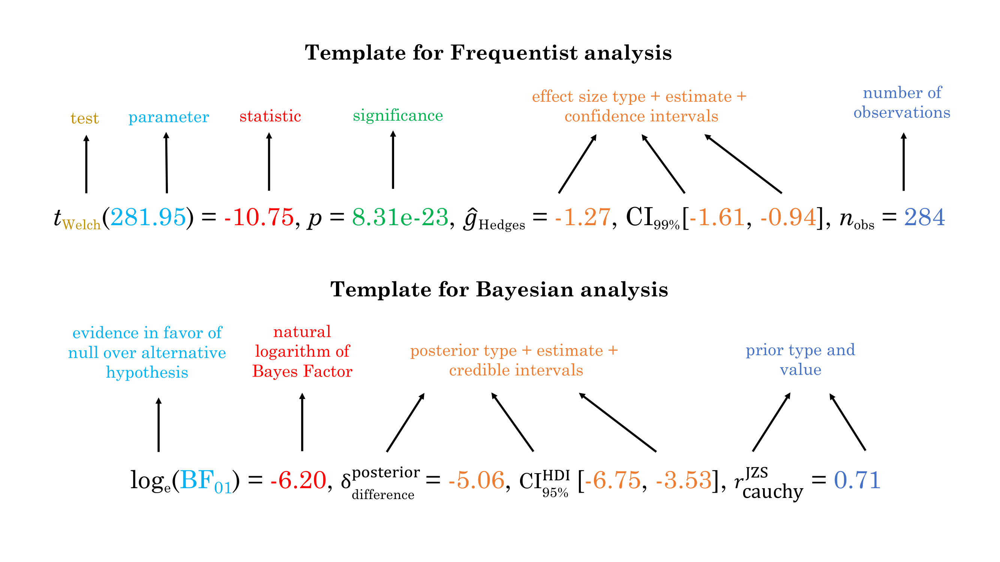

```{r message=FALSE, warning=FALSE, echo=FALSE}
# to pretty-print all columns in the output tibble
options(
  tibble.width = Inf,
  pillar.bold = TRUE,
  pillar.neg = TRUE,
  pillar.subtle_num = TRUE,
  pillar.min_chars = Inf
)

knitr::opts_chunk$set(
  collapse = TRUE,
  dpi = 300,
  warning = FALSE,
  message = FALSE,
  out.width = "100%",
  comment = "#>"
)

# needed libraries
library(dplyr)
library(statsExpressions)
library(ggplot2)
library(ggridges)
library(palmerpenguins)

# for reproducibility
set.seed(123)
```

# Summary

The `{statsExpressions}` package has two key aims: to provide a consistent syntax
to do statistical analysis with tidy data, and to provide statistical
expressions (i.e., pre-formatted in-text statistical results) for plotting
functions. Currently, it supports common types of statistical approaches and
tests: parametric, nonparametric, robust, and Bayesian *t*-test, one-way ANOVA,
correlation analyses, contingency table analyses, and meta-analyses. The
functions are pipe-friendly and compatible with tidy data.

# Statement of need

Statistical packages exhibit substantial diversity in terms of their syntax and
expected input and output data type. For example, some functions expect vectors
as inputs, while others expect dataframes. Depending on whether it is a repeated
measures design or not, functions from the same package might expect data to be
in wide or tidy format. Some functions can internally omit missing values, while
others do not. Furthermore, the statistical test objects returned by the test
functions might not have all required information (e.g., degrees of freedom,
significance, Bayes factor, etc.) accessible in a consistent data type.
Depending on the specific test object and statistic in question, details may be
returned as a list, a matrix, an array, or a dataframe. This diversity can make
it difficult to easily access all needed information for hypothesis testing and
estimation, and to switch from one statistical approach to another.

This is where `{statsExpressions}` comes in: It can be thought of as a unified
portal through which most of the functionality in these underlying packages can
be accessed, with a simpler interface and with tidy data format.

# Comparison to Other Packages

Unlike `broom` [@Robinson2021] or `parameters` [@Lüdecke2020parameters], the
goal of `{statsExpressions}` is not to convert model objects into tidy dataframes,
but to provide a consistent and easy syntax to carry out statistical tests.
Additionally, none of these packages return statistical expressions.

# Consistent Syntax for Statistical Analysis

The package offers functions that allow users choose a statistical approach
without changing the syntax (i.e., by only specifying a single argument). The
functions always require a dataframe in tidy format [@Wickham2019], and work
with missing data. Moreover, they always return a dataframe that can be further
utilized downstream in the workflow (such as visualization).

Function | Parametric | Non-parametric | Robust | Bayesian
------------------ | ---- | ----- | ----| ----- 
`one_sample_test` | \checkmark | \checkmark | \checkmark | \checkmark
`two_sample_test` | \checkmark | \checkmark | \checkmark | \checkmark
`oneway_anova` | \checkmark | \checkmark | \checkmark | \checkmark
`corr_test` | \checkmark | \checkmark | \checkmark | \checkmark
`contingency_table` | \checkmark | \checkmark | - | \checkmark
`meta_analysis` | \checkmark | - | \checkmark | \checkmark

: A summary table listing the primary functions in the package and the
statistical approaches they support. More detailed description of the
tests and outputs from these functions can be found on the package website: <https://indrajeetpatil.github.io/statsExpressions/articles/>.

`{statsExpressions}` internally relies on `stats` package for parametric and
non-parametric [@base2021], `WRS2` package for robust [@Mair2020], and
`BayesFactor` package for Bayesian statistics [@Morey2020]. The random-effects
meta-analysis is carried out using `metafor` (parametric) [@Viechtbauer2010],
`metaplus` (robust) [@Beath2016], and `metaBMA` (Bayesian) [@Heck2019] packages.
Additionally, it relies on `easystats` packages [@Ben-Shachar2020;
@Lüdecke2020parameters;
@Lüdecke2020performance; @Lüdecke2019; @Makowski2019; @Makowski2020] to compute
appropriate effect size/posterior estimates and their confidence/credible
intervals.

# Tidy Dataframes from Statistical Analysis

To illustrate the simplicity of this syntax, let's say we want to run a one-way
ANOVA. If we first run a non-parametric ANOVA and then decide to run a robust
ANOVA instead, the syntax remains the same and the statistical approach can be
modified by changing a single argument:

```{r df_p}
mtcars %>% oneway_anova(cyl, wt, type = "nonparametric")

mtcars %>% oneway_anova(cyl, wt, type = "robust")
```

These functions are also compatible with other popular data manipulation
packages (see Appendix for an example).

# Expressions for Plots

In addition to other details contained in the dataframe, there is also a column
titled `expression`, which contains a pre-formatted text with statistical
details. These expressions (Figure 1) attempt to follow the gold standard in
statistical reporting for both Bayesian [@van2020jasp] and Frequentist
[@american2019publication] frameworks.

```{r expr_template, echo=FALSE, fig.cap="The templates used in `{statsExpressions}` to display statistical details in a plot."}

```

This expression be easily displayed in a plot (Figure 2). Displaying statistical
results in the context of a visualization is indeed a philosophy adopted by the
`ggstatsplot` package [@Patil2021], and `{statsExpressions}` functions as its
statistical processing backend.

```{r anova_example, echo=FALSE, fig.cap="Example illustrating how `{statsExpressions}` functions can be used to display results from a statistical test in a plot. Code to create this figure is reported in Appendix."}
# needed libraries
library(statsExpressions)
library(ggplot2)
library(ggridges)
library(palmerpenguins) # `penguins` dataset is from this package

# creating a dataframe
res <- oneway_anova(penguins, species, body_mass_g, type = "nonparametric")

# create a ridgeplot using `ggridges` package
ggplot(penguins, aes(x = body_mass_g, y = species)) +
  geom_density_ridges(
    jittered_points = TRUE,
    quantile_lines = TRUE,
    scale = 0.9,
    vline_size = 1,
    vline_color = "red",
    position = position_raincloud(adjust_vlines = TRUE)
  ) + # use 'expression' column to display results in the subtitle
  labs(
    x = "Penguin species",
    y = "Body mass (in grams)",
    title = "Kruskal-Wallis Rank Sum Test",
    subtitle = res$expression[[1]]
  )
```

# Licensing and Availability

`{statsExpressions}` is licensed under the GNU General Public License (v3.0), with all
source code stored at [GitHub](https://github.com/IndrajeetPatil/statsExpressions/).
In the spirit of honest and open science, requests and suggestions for fixes,
feature updates, as well as general questions and concerns are encouraged via
direct interaction with contributors and developers by filing an
[issue](https://github.com/IndrajeetPatil/statsExpressions/issues) while respecting
[*Contribution Guidelines*](https://indrajeetpatil.github.io/statsExpressions/CONTRIBUTING.html).

# Acknowledgements

I would like to acknowledge the support of Mina Cikara, Fiery Cushman, and Iyad
Rahwan during the development of this project. `{statsExpressions}` relies heavily
on the [`easystats`](https://github.com/easystats/easystats) ecosystem, a
collaborative project created to facilitate the usage of `R` for statistical
analyses. Thus, I would like to thank the [members of easystats](https://github.com/orgs/easystats/people) as well as the users.

# References

<div id="refs"></div>

# Appendix

## Example with `dplyr`

We can use combination of `dplyr` and `{statsExpressions}` to repeat the same
statistical analysis across grouping variables.

```{r grouped_df}
# running one-sample proportion test for all levels of `cyl`
mtcars %>%
  group_by(cyl) %>%
  group_modify(~ contingency_table(.x, am), .keep = TRUE) %>%
  ungroup()
```

## Code to reproduce for Figure 2

```{r ref.label="anova_example", echo=TRUE, eval=FALSE}
```
